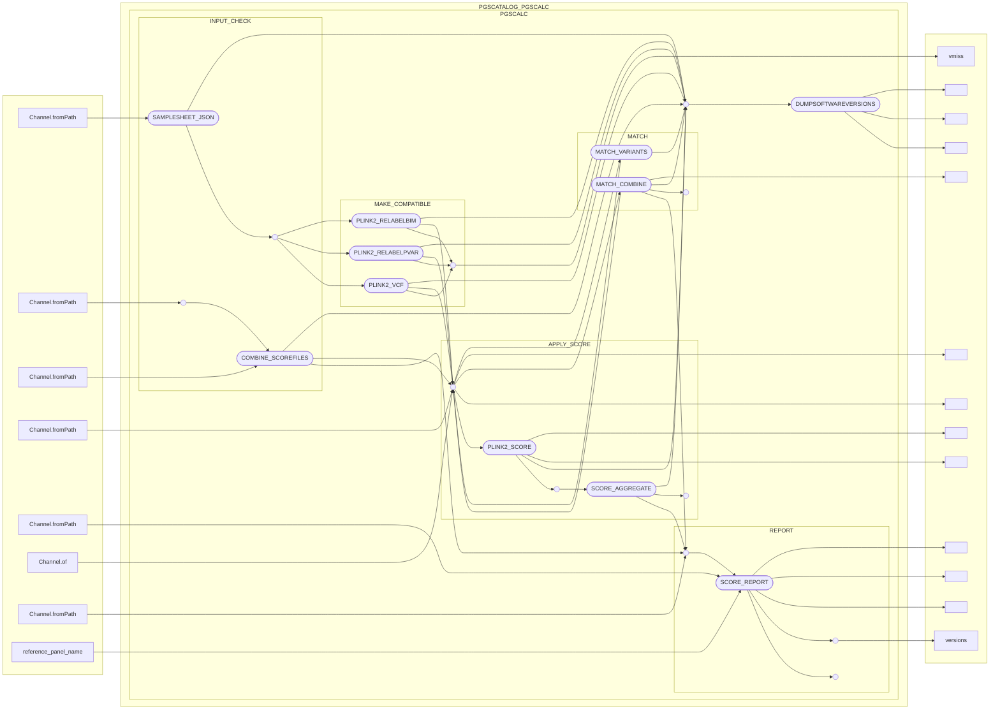

# pgsc_calc

Web: <https://pgsc-calc.readthedocs.io/en/latest/> (GitHub, <https://github.com/PGScatalog/pgsc_calc>)

## Installation

This is furnished by a number of modules,

```bash
module load ceuadmin/Anaconda3/2023.09-0
module load ceuadmin/openjdk/11.0.20+8
module load ceuadmin/go/1.21.6
module load ceuadmin/fraposa_pgsc/0.1.0
module load ceuadmin/singularity/4.0.3
module load ceuadmin/nextflow/23.10.1
module load ceuadmin/plink/2.00a3.3
module load ceuadmin/quarto/1.3.450-icelake
```

The last module apparently only works on icelake. Specific handling of individual module is documented on the ceuadmin
section when appropriate.

## Usage

```
module load ceuadmin/pgsc_calc
nextflow run pgscatalog/pgsc_calc -profile test,singularity
```

The screen output is given as follows,

```
N E X T F L O W  ~  version 23.10.1
Launching `https://github.com/pgscatalog/pgsc_calc` [soggy_volhard] DSL2 - revision: 83326a1e60 [main]

WARN: Found unexpected parameters:
* --config_profile_description: Minimal test dataset to check pipeline function
* --config_profile_name: Test profile
* --ref_format_version: v0.1
* --ancestry_checksums: /home/jhz22/.nextflow/assets/pgscatalog/pgsc_calc/assets/ancestry/checksums.txt
- Ignore this warning: params.schema_ignore_params = "config_profile_description,config_profile_name,ref_format_version,ancestry_checksums"


------------------------------------------------------
  pgscatalog/pgsc_calc v2.0.0-alpha.4
------------------------------------------------------
Core Nextflow options
  revision          : main
  runName           : soggy_volhard
  containerEngine   : singularity
  launchDir         : /home/jhz22
  workDir           : /home/jhz22/work
  projectDir        : /home/jhz22/.nextflow/assets/pgscatalog/pgsc_calc
  userName          : jhz22
  profile           : test,singularity
  configFiles       : /home/jhz22/.nextflow/assets/pgscatalog/pgsc_calc/nextflow.config

Input/output options
  input             : /home/jhz22/.nextflow/assets/pgscatalog/pgsc_calc/assets/examples/samplesheet.csv
  scorefile         : /home/jhz22/.nextflow/assets/pgscatalog/pgsc_calc/assets/examples/scorefiles/PGS001229_22.txt
  genotypes_cache   : null
  outdir            : /home/jhz22/.nextflow/assets/pgscatalog/pgsc_calc/results

Reference options
  run_ancestry      : null
  ref_samplesheet   : /home/jhz22/.nextflow/assets/pgscatalog/pgsc_calc/assets/ancestry/reference.csv
  ld_grch37         : /home/jhz22/.nextflow/assets/pgscatalog/pgsc_calc/assets/ancestry/high-LD-regions-hg19-GRCh37.txt
  ld_grch38         : /home/jhz22/.nextflow/assets/pgscatalog/pgsc_calc/assets/ancestry/high-LD-regions-hg38-GRCh38.txt

Compatibility options
  target_build      : GRCh37

Max job request options
  max_cpus          : 2
  max_memory        : 6.GB
  max_time          : 6.h

Generic options
  tracedir          : ./results/pipeline_info

Other parameters
  ancestry_checksums: /home/jhz22/.nextflow/assets/pgscatalog/pgsc_calc/assets/ancestry/checksums.txt

!! Only displaying parameters that differ from the pipeline defaults !!
------------------------------------------------------
If you use pgscatalog/pgsc_calc for your analysis please cite:

* The Polygenic Score Catalog
  https://doi.org/10.1038/s41588-021-00783-5

* The nf-core framework
  https://doi.org/10.1038/s41587-020-0439-x

* Software dependencies
  https://github.com/pgscatalog/pgsc_calc/blob/master/CITATIONS.md
------------------------------------------------------
executor >  local (9)
[62/2fd11c] process > PGSCATALOG_PGSCALC:PGSCALC:INPUT_CHECK:SAMPLESHEET_JSON (samplesheet.csv)                         [100%] 1 of 1 ✔
[a3/41cbab] process > PGSCATALOG_PGSCALC:PGSCALC:INPUT_CHECK:COMBINE_SCOREFILES (1)                                     [100%] 1 of 1 ✔
[-        ] process > PGSCATALOG_PGSCALC:PGSCALC:MAKE_COMPATIBLE:PLINK2_RELABELBIM                                      -
[83/dbf870] process > PGSCATALOG_PGSCALC:PGSCALC:MAKE_COMPATIBLE:PLINK2_RELABELPVAR (cineca chromosome 22)              [100%] 1 of 1 ✔
[-        ] process > PGSCATALOG_PGSCALC:PGSCALC:MAKE_COMPATIBLE:PLINK2_VCF                                             -
[f2/b2b534] process > PGSCATALOG_PGSCALC:PGSCALC:MATCH:MATCH_VARIANTS (cineca chromosome 22)                            [100%] 1 of 1 ✔
[dc/de0a47] process > PGSCATALOG_PGSCALC:PGSCALC:MATCH:MATCH_COMBINE (cineca)                                           [100%] 1 of 1 ✔
[8e/fcf1cd] process > PGSCATALOG_PGSCALC:PGSCALC:APPLY_SCORE:PLINK2_SCORE (cineca chromosome 22 effect type additive 0) [100%] 1 of 1 ✔
[ba/ea50cd] process > PGSCATALOG_PGSCALC:PGSCALC:APPLY_SCORE:SCORE_AGGREGATE (cineca)                                   [100%] 1 of 1 ✔
[08/5ef276] process > PGSCATALOG_PGSCALC:PGSCALC:REPORT:SCORE_REPORT (cineca)                                           [100%] 1 of 1 ✔
[d6/4e7a76] process > PGSCATALOG_PGSCALC:PGSCALC:DUMPSOFTWAREVERSIONS (1)                                               [100%] 1 of 1 ✔
-[pgscatalog/pgsc_calc] Pipeline completed successfully-
Please remember to cite polygenic score authors if you publish with them!
Check the output report for citation details
```

The DAG from the output is shown here from left to right,



<script type="module">
  import mermaid from 'https://cdn.jsdelivr.net/npm/mermaid@10/dist/mermaid.esm.min.mjs';
  mermaid.initialize({ startOnLoad: true });
</script>
