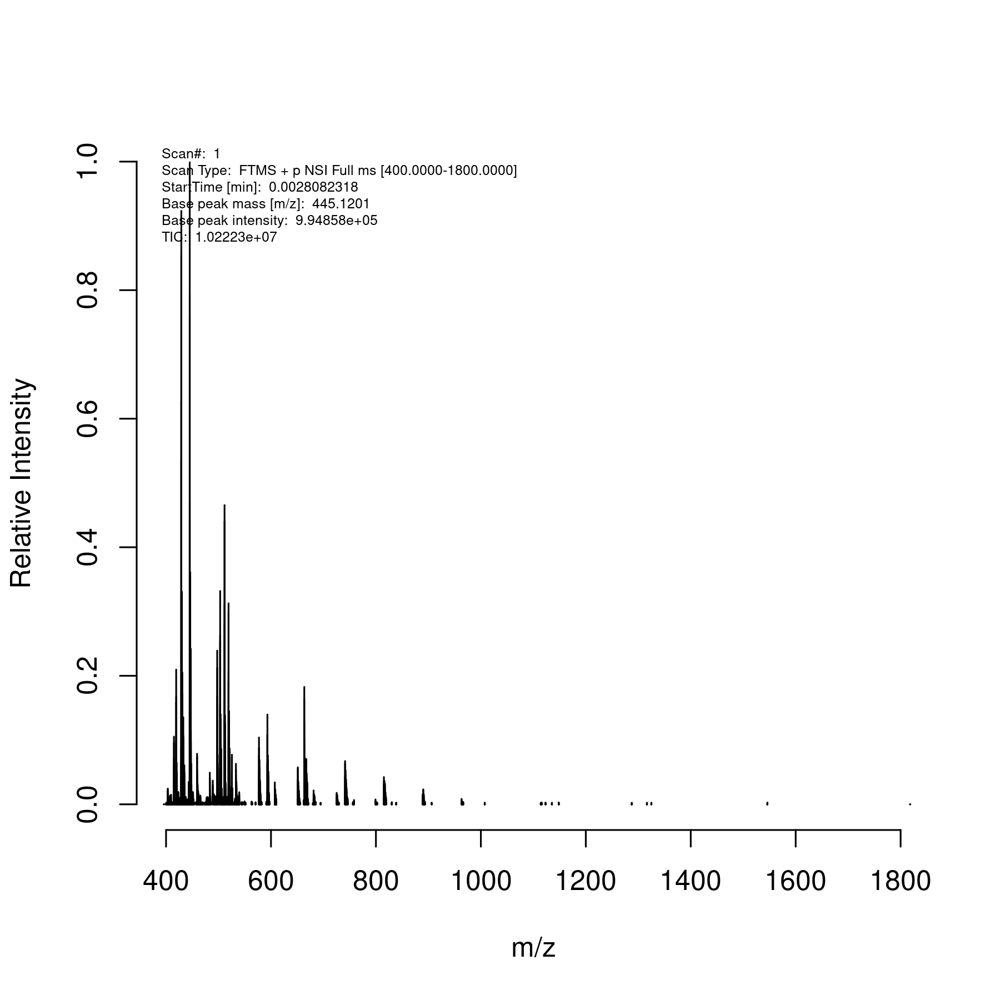

# rawrr

Web: [Bioconductor](https://bioconductor.org/packages/release/bioc/vignettes/rawrr/inst/doc/rawrr.html) (<https://bioc.r-universe.dev/rawrr>) 

## Installation

We can start with `BiocManager::install("rawrr")` or `install.packages("rawrr", repos = c("https://bioc.r-universe.dev", "https://cloud.r-project.org"))` from R, and get the following messages,

```
> library(rawrr)
'ThermoFisher.CommonCore.BackgroundSubtraction.dll' is missing.
'ThermoFisher.CommonCore.Data.dll' is missing.
'ThermoFisher.CommonCore.MassPrecisionEstimator.dll' is missing.
'ThermoFisher.CommonCore.RawFileReader.dll' is missing.
'ThermoFisher.CommonCore.*.dll' files are not available on the system.
Run 'rawrr::installRawFileReaderDLLs()' or setenv MONO_PATH to the location where the assemblies are located.
For more information, type '?ThermoFisher'.
Package 'rawrr' version 1.12.0 using
RawFileReader reading tool. Copyright © 2016 by Thermo Fisher Scientific, Inc. All rights reserved.
```

The error messages can be suppressed with `installRawFileReaderDLLs()`

```
> if (isFALSE(rawrr::.checkDllInMonoPath())){
+   rawrr::installRawFileReaderDLLs()
+ }
'ThermoFisher.CommonCore.BackgroundSubtraction.dll' is missing.
'ThermoFisher.CommonCore.Data.dll' is missing.
'ThermoFisher.CommonCore.MassPrecisionEstimator.dll' is missing.
'ThermoFisher.CommonCore.RawFileReader.dll' is missing.
'ThermoFisher.CommonCore.*.dll' files are not available on the system.
Run 'rawrr::installRawFileReaderDLLs()' or setenv MONO_PATH to the location where the assemblies are located.
For more information, type '?ThermoFisher'.
Do you accept the Thermo License agreement '/rds/project/rds-4o5vpvAowP0/software/R/rawrr/rawrrassembly/RawFileReaderLicense.txt'? [Y/n]: y
trying URL 'https://github.com/thermofisherlsms/RawFileReader/raw/main/Libs/Net471//ThermoFisher.CommonCore.BackgroundSubtraction.dll'
Content type 'application/octet-stream' length 44544 bytes (43 KB)
==================================================
downloaded 43 KB

trying URL 'https://github.com/thermofisherlsms/RawFileReader/raw/main/Libs/Net471//ThermoFisher.CommonCore.Data.dll'
Content type 'application/octet-stream' length 406016 bytes (396 KB)
==================================================
downloaded 396 KB

trying URL 'https://github.com/thermofisherlsms/RawFileReader/raw/main/Libs/Net471//ThermoFisher.CommonCore.MassPrecisionEstimator.dll'
Content type 'application/octet-stream' length 11264 bytes (11 KB)
==================================================
downloaded 11 KB

trying URL 'https://github.com/thermofisherlsms/RawFileReader/raw/main/Libs/Net471//ThermoFisher.CommonCore.RawFileReader.dll'
Content type 'application/octet-stream' length 654336 bytes (639 KB)
==================================================
downloaded 639 KB

 ThermoFisher.CommonCore.BackgroundSubtraction.dll
                                                 0
                  ThermoFisher.CommonCore.Data.dll
                                                 0
ThermoFisher.CommonCore.MassPrecisionEstimator.dll
                                                 0
         ThermoFisher.CommonCore.RawFileReader.dll
                                                 0
>
> if (isFALSE(file.exists(rawrr:::.rawrrAssembly()))){
+  rawrr::installRawrrExe()
+ }
>
> library(rawrr)
Package 'rawrr' version 1.12.0 using
RawFileReader reading tool. Copyright © 2016 by Thermo Fisher Scientific, Inc. All rights reserved.
> q()
```

## Testing

We use a real data here, 

```
> cwd <- getwd()
> setwd("~/Caprion/pre_qc_data/spectral_library_ZWK/")
> readSpectrum("szwk901104i19901xms1.raw",scan=1)
[[1]]
Total Ion Current:       10222295
Scan Low Mass:   400
Scan High Mass:  1800
Scan Start Time (min):   0.002808232
Scan Number:     1
Base Peak Intensity:     994858
Base Peak Mass:  445.1201
Scan Mode:       FTMS + p NSI Full ms [400.0000-1800.0000]
======= Instrument data =====   :       NULL
Multiple Injection:     ii
Multi Inject Info:      IT=15;15
AGC:    On
Micro Scan Count:       1
Scan Segment:   1
Scan Event:     1
Master Index:   0
Charge State:   0
Monoisotopic M/Z:       0.0000
Ion Injection Time (ms):        30.000
Max. Ion Time (ms):     30.00
FT Resolution:  70000
MS2 Isolation Width:    1400.00
MS2 Isolation Offset:   0.00
AGC Target:     3000000
HCD Energy:
Analyzer Temperature:   29.92
=== Mass Calibration:   NULL
Conversion Parameter B: 67839603.0252
Conversion Parameter C: 35794268.3879
Temperature Comp. (ppm):        -5.61
RF Comp. (ppm): 0.08
Space Charge Comp. (ppm):       -0.22
Resolution Comp. (ppm): -0.15
Number of Lock Masses:  0
Lock Mass #1 (m/z):     0.0000
Lock Mass #2 (m/z):     0.0000
Lock Mass #3 (m/z):     0.0000
LM Search Window (ppm): 0.0
LM Search Window (mmu): 0.0
Number of LM Found:     0
Last Locking (sec):     0.0
LM m/z-Correction (ppm):        0.00
=== Ion Optics Settings:        NULL
S-Lens RF Level:        50.00
S-Lens Voltage (V):     25.00
Skimmer Voltage (V):    15.00
Inject Flatapole Offset (V):    8.00
Bent Flatapole DC (V):  6.00
MP2 and MP3 RF (V):     900.00
Gate Lens Voltage (V):  5.25
C-Trap RF (V):  2400.0
====  Diagnostic Data:  NULL
Intens Comp Factor:     0.6884
Res. Dep. Intens:       1.215
CTCD NumF:      16
CTCD Comp:      5.390
CTCD ScScr:     0.792
RawOvFtT:       231010.0
LC FWHM parameter:      15.0
Rod:    0
PS Inj. Time (ms):      0.640
AGC PS Mode:    1
AGC PS Diag:    4001800
HCD Energy eV:  0.000
AGC Fill:       0.01
Injection t0:   0.044
t0 FLP: 429.09
Access Id:      0
Analog Input 1 (V):     0.000
Analog Input 2 (V):     0.000

attr(,"class")
[1] "rawrrSpectrumSet"
> sz1 <- readSpectrum("szwk901104i19901xms1.raw",scan=1)
  x$centroidStream is not TRUE
> setwd(cwd)
> png("sz.png",res=300,height=6,width=6,units="in")
> plot(sz1[[1]], centroid=FALSE)
> dev.off()
```

as shown here, .

## MsBackendRawFileReader

This is closely related; for the example above we try

```
>      beRaw <- Spectra::backendInitialize(MsBackendRawFileReader::MsBackendRawFileReader(),
+        files = dir(patt="raw"))
> class(beRaw)
[1] "MsBackendRawFileReader"
attr(,"package")
[1] "MsBackendRawFileReader"
> beRaw
MsBackendRawFileReader with 1935241 spectra
          msLevel      rtime scanIndex
        <integer>  <numeric> <integer>
1               1 0.00280752         1
2               2 0.00977762         2
3               2 0.01136105         3
4               1 0.01378255         4
5               1 0.01998046         5
...           ...        ...       ...
1935237         1    52.4772     24262
1935238         1    52.4829     24263
1935239         1    52.4886     24264
1935240         1    52.4942     24265
1935241         1    52.4999     24266
 ... 30 more variables/columns.

file(s):
szwk021704i19101xms1.raw
szwk021704i19101xms2.raw
szwk021704i19101xms3.raw
 ... 77 more files
> beRaw |> Spectra::spectraVariables()
 [1] "msLevel"                 "rtime"
 [3] "acquisitionNum"          "scanIndex"
 [5] "mz"                      "intensity"
 [7] "dataStorage"             "dataOrigin"
 [9] "centroided"              "smoothed"
[11] "polarity"                "precScanNum"
[13] "precursorMz"             "precursorIntensity"
[15] "precursorCharge"         "collisionEnergy"
[17] "isolationWindowLowerMz"  "isolationWindowTargetMz"
[19] "isolationWindowUpperMz"  "scanType"
[21] "charge"                  "masterScan"
[23] "dependencyType"          "monoisotopicMz"
[25] "AGC"                     "injectionTime"
[27] "resolution"              "isolationWidth"
[29] "isolationOffset"         "AGCTarget"
[31] "collisionEnergyList"     "AGCFill"
[33] "isStepped"
```

See [MsBackendRawFileReader.html](https://bioconductor.org/packages/release/bioc/vignettes/MsBackendRawFileReader/inst/doc/MsBackendRawFileReader.html) for additional information.
