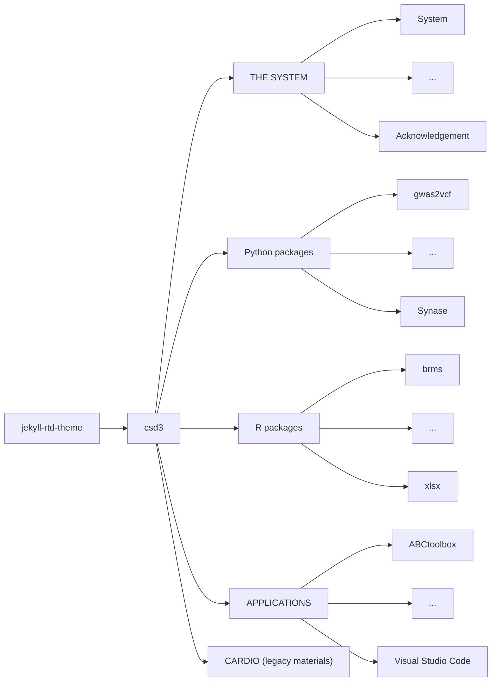

# CSD3 -- Cambridge Service for Data Driven Discovery

```mermaid
graph LR;
jekyll-rtd-theme --> csd3
csd3 --> system["THE SYSTEM"]
csd3 --> Python["Python packages"]
csd3 --> R["R packages"]
csd3 --> applications["APPLICATIONS"]
csd3 --> cardio["CARDIO (legacy materials)"]
system --> System
system --> sysdot["..."]
system --> Acknowledgement
applications --> ABCtoolbox
applications --> appdot["..."]
applications --> vsc["Visual Studio Code"]
Python --> gwas2vcf
Python --> Pythondot["..."]
Python --> Synase
R --> brms
R --> Rdot["..."]
R --> xlsx
```


