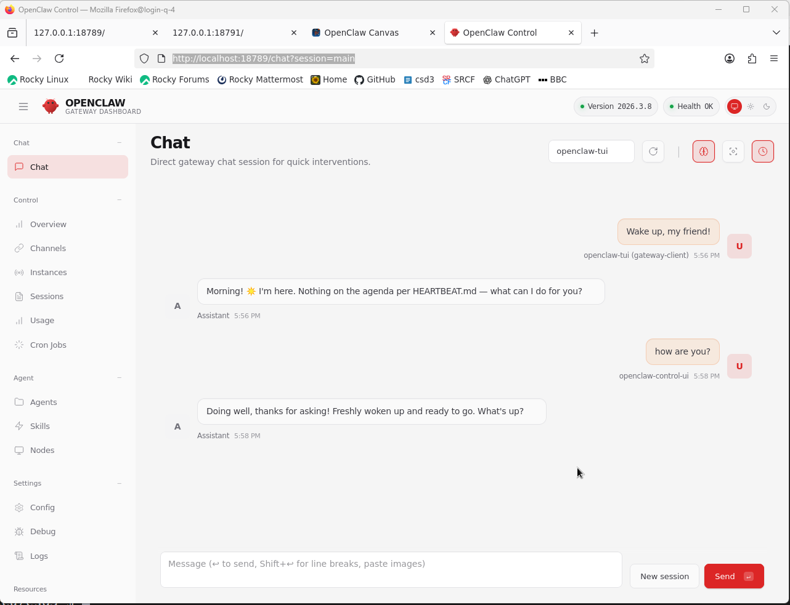

# OpenClaw

Web: <https://openclaw.ai/>

## 2026.3.28

```bash
# OpenClaw/2026.3.28
module load ceuadmin/node/22.16.0
export BASE="$CEUADMIN/OpenClaw/2026.3.28"
npm view openclaw versions
npm install -g openclaw@2026.3.28 --prefix "$BASE"
# Extensions
module load ceuadmin/OpenClaw/2026.3.28
export OPENCLAW_STATE_DIR="$BASE/state"
export OPENCLAW_CONFIG_PATH="$BASE/config.json"
openclaw plugins install ollama
```

## Setup

It has a flavour of settings for libvips.

```bash
source ~/rds/software/py3.11/bin/activate
module load ceuadmin/libvips/8.18.0
module load ceuadmin/node/22.16.0
npm install -g node-gyp --prefix "$CEUADMIN/OpenClaw/2026.3.8"
npm install -g openclaw --prefix "$CEUADMIN/OpenClaw/2026.3.8"
```

so that the openclaw binary and packages are installed according to --prefix.

Alternatively,

```bash
NPM_CONFIG_PREFIX=$CEUADMIN/OpenClaw/2026.3.8 curl -fsSL https://openclaw.ai/install.sh | bash
# npm install -g openclaw --build-from-source --prefix "$CEUADMIN/OpenClaw/2026.3.8"
```

OpenClaw is effectively installed as a node modules sitting with node/22.16.0 as a matter of convenience.

## Usage

```bash
module load ceuadmin/OpenClaw
openclaw --help
```

which gives,

```
OpenClaw 2026.3.8 (3caab92)

🦞 OpenClaw 2026.3.8 (3caab92) — I'm the middleware between your ambition and your attention span.

Usage: openclaw [options] [command]

Options:
  --dev                Dev profile: isolate state under ~/.openclaw-dev, default gateway port 19001, and shift derived ports (browser/canvas)
  -h, --help           Display help for command
  --log-level <level>  Global log level override for file + console (silent|fatal|error|warn|info|debug|trace)
  --no-color           Disable ANSI colors
  --profile <name>     Use a named profile (isolates OPENCLAW_STATE_DIR/OPENCLAW_CONFIG_PATH under ~/.openclaw-<name>)
  -V, --version        output the version number

Commands:
  Hint: commands suffixed with * have subcommands. Run <command> --help for details.
  acp *                Agent Control Protocol tools
  agent                Run one agent turn via the Gateway
  agents *             Manage isolated agents (workspaces, auth, routing)
  approvals *          Manage exec approvals (gateway or node host)
  backup *             Create and verify local backup archives for OpenClaw state
  browser *            Manage OpenClaw's dedicated browser (Chrome/Chromium)
  channels *           Manage connected chat channels (Telegram, Discord, etc.)
  clawbot *            Legacy clawbot command aliases
  completion           Generate shell completion script
  config *             Non-interactive config helpers (get/set/unset/file/validate). Default: starts setup wizard.
  configure            Interactive setup wizard for credentials, channels, gateway, and agent defaults
  cron *               Manage cron jobs via the Gateway scheduler
  daemon *             Gateway service (legacy alias)
  dashboard            Open the Control UI with your current token
  devices *            Device pairing + token management
  directory *          Lookup contact and group IDs (self, peers, groups) for supported chat channels
  dns *                DNS helpers for wide-area discovery (Tailscale + CoreDNS)
  docs                 Search the live OpenClaw docs
  doctor               Health checks + quick fixes for the gateway and channels
  gateway *            Run, inspect, and query the WebSocket Gateway
  health               Fetch health from the running gateway
  help                 Display help for command
  hooks *              Manage internal agent hooks
  logs                 Tail gateway file logs via RPC
  memory *             Search and reindex memory files
  message *            Send, read, and manage messages
  models *             Discover, scan, and configure models
  node *               Run and manage the headless node host service
  nodes *              Manage gateway-owned node pairing and node commands
  onboard              Interactive onboarding wizard for gateway, workspace, and skills
  pairing *            Secure DM pairing (approve inbound requests)
  plugins *            Manage OpenClaw plugins and extensions
  qr                   Generate iOS pairing QR/setup code
  reset                Reset local config/state (keeps the CLI installed)
  sandbox *            Manage sandbox containers for agent isolation
  secrets *            Secrets runtime reload controls
  security *           Security tools and local config audits
  sessions *           List stored conversation sessions
  setup                Initialize local config and agent workspace
  skills *             List and inspect available skills
  status               Show channel health and recent session recipients
  system *             System events, heartbeat, and presence
  tui                  Open a terminal UI connected to the Gateway
  uninstall            Uninstall the gateway service + local data (CLI remains)
  update *             Update OpenClaw and inspect update channel status
  webhooks *           Webhook helpers and integrations

Examples:
  openclaw models --help
    Show detailed help for the models command.
  openclaw channels login --verbose
    Link personal WhatsApp Web and show QR + connection logs.
  openclaw message send --target +15555550123 --message "Hi" --json
    Send via your web session and print JSON result.
  openclaw gateway --port 18789
    Run the WebSocket Gateway locally.
  openclaw --dev gateway
    Run a dev Gateway (isolated state/config) on ws://127.0.0.1:19001.
  openclaw gateway --force
    Kill anything bound to the default gateway port, then start it.
  openclaw gateway ...
    Gateway control via WebSocket.
  openclaw agent --to +15555550123 --message "Run summary" --deliver
    Talk directly to the agent using the Gateway; optionally send the WhatsApp reply.
  openclaw message send --channel telegram --target @mychat --message "Hi"
    Send via your Telegram bot.

Docs: docs.openclaw.ai/cli
```

## Ollama

The official news on OpenClaw with ollama involves `ollama launch openclaw` where OpenClaw tries to install a systemd service, which 
is not allowed on HPC login nodes, so we start manually.

```bash
module load ceuadmin/ollama
ollama serve > /dev/null 2>&1 &
until ollama list; do
  sleep 1
done
module load ceuadmin/OpenClaw
openclaw onboard
openclaw gateway &
```

where `openclaw onboard` sets up the environment (from ollama 0.18, it is official provider for OpenClaw, i.e., `openclaw onboard --auth-choice ollama`) and our instance of `openclaw gateway` gives,

```
🦞 OpenClaw 2026.3.8 (3caab92) — Your personal assistant, minus the passive-aggressive calendar reminders.

15:53:10 [canvas] host mounted at http://127.0.0.1:18789/__openclaw__/canvas/ (root /home/jhz22/.openclaw/canvas)
15:53:10 [heartbeat] started
15:53:10 [health-monitor] started (interval: 300s, startup-grace: 60s, channel-connect-grace: 120s)
15:53:10 [gateway] agent model: ollama/minimax-m2.5:cloud
15:53:10 [gateway] listening on ws://127.0.0.1:18789 (PID 322663)
15:53:10 [gateway] log file: /tmp/openclaw/openclaw-2026-03-11.log
15:53:10 [browser/server] Browser control listening on http://127.0.0.1:18791/ (auth=token)
```

Surely, these are useful for letting web browsers point to the appropriate ports.

Now we try `ollama launch openclaw` again,

```
This will modify your OpenClaw configuration:
  /home/jhz22/.openclaw/openclaw.json
Backups will be saved to /rds/user/jhz22/hpc-work/work/ollama-backups/

Added minimax-m2.5:cloud to OpenClaw

Launching OpenClaw with minimax-m2.5:cloud...

Security

  OpenClaw can read files and run actions when tools are enabled.
  A bad prompt can trick it into doing unsafe things.

  Learn more: https://docs.openclaw.ai/gateway/security

I understand the risks. Continue?

   Yes    No
  ✓ Installed web search plugin

Preparing your assistant — this may take a moment...

17:54:21 [reload] config change detected; evaluating reload (tools.web, plugins)
17:54:21 [reload] config change requires gateway restart (plugins)
17:54:21 [gateway] signal SIGUSR1 received
17:54:21 [gateway] received SIGUSR1; restarting
17:54:56 [gateway] shutdown timed out; exiting without full cleanup
  Warning: gateway did not come back after restart
Starting gateway...

✓ OpenClaw is running

  Open the Web UI:
    http://localhost:18789/#token=ollama

  Quick start:
    /help             see all commands
    openclaw configure --section channels   connect WhatsApp, Telegram, etc.
    openclaw skills                         browse and install skills

  The OpenClaw gateway is running in the background.
  Stop it with: openclaw gateway stop


🦞 OpenClaw 2026.3.8 (3caab92) — Half butler, half debugger, full crustacean.

 openclaw tui - ws://127.0.0.1:18789 - agent main - session main

 session agent:main:main


 Wake up, my friend!


 Morning! ☀️ I'm here. Nothing on the agenda per HEARTBEAT.md — what can I do for you?


 how are you?


 Doing well, thanks for asking! Freshly woken up and ready to go. What's up?
 connected | idle
 agent main | session main (openclaw-tui) | ollama/minimax-m2.5:cloud | think low | tokens 9.3k/205k (5%)
```

Note that additionally, we have

```bash
# connect WhatsApp, Telegram, etc.
openclaw configure --section channels
# browse and install skills
openclaw skills   
# start a specific model
ollama launch openclaw --model kimi-k2.5:cloud
ollama launch openclaw --model gemma4:31b-cloud
ollama launch openclaw --model glm-5.1:cloud
```

The web UI `http://localhost:18789/#token=ollama` (or `http://localhost:18789/chat?session=main`) actually provides a gateway dashboard shown below, which is more desirable.



### MiniMax-M2.7

This model is designed to excel at completing end-to-end tasks in software engineering and office productivity while improving its character and emotional intelligence.
M2.7 is also good at self-improvement using data from the web. Start the model with `ollama launch openclaw --model minimax-m2.7:cloud`, or when OpenClaw is running, `/model ollama/minimax-m2.7:cloud`. An exemplar use of self-improvement and research can be done with

> Teach yourself how to write financial research reports by studying examples from top analysts. Write a PPT presentation and Word document report on TSMC based on their latest earnings. Save your research framework as a skill so future reports follow the same process.

To launch an agent non-interactively (--yes),

```bash
ollama launch openclaw \
--model minimax-m2.7:cloud \
--yes -- agent \
--agent main \
--local \
--message "Prepare a pre-read for my next meeting"
```
