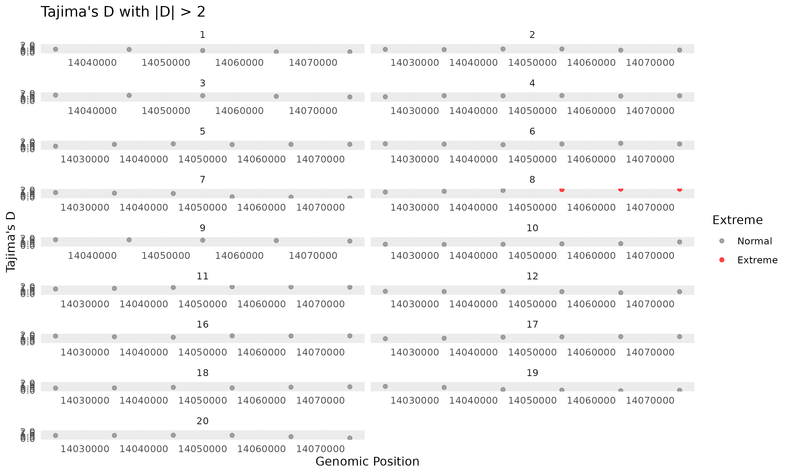

# angsd

Web, <https://www.popgen.dk/angsd/index.php/ANGSD>

## 0.940

### Installation

```bash
wget -qO- https://github.com/ANGSD/angsd/releases/download/0.940/angsd0.940.tar.gz | \
tar xf -
cd htslib
make # install prefix=$CEUADMIN/angsd/0.940
make clean
cd -    
cd angsd
make HTSSRC=../htslib install prefix=$CEUADMIN/angsd/0.940
make clean
```

Note that 

1. angsd0.940.tar.gz file is actually a tar file (NOT gzipped).
2. The make command for htslib can also give a complete bin/include/lib/share set.
3. Once installed, object files are cleaned in both cases.
4. The package is associated withhtslib/1.16, and for 1.20 we use `make HTSSRC=/usr/local/Cluster-Apps/ceuadmin/htslib/1.20/lib`.

### docker / singularity

Since the option `docker pull thorfinn/angsd` is unavailable, we turn to singularity.

```bash
# check https://quay.io/repository/biocontainers/angsd?tab=tags
singularity pull docker://quay.io/biocontainers/angsd:0.940--h13024bc_4
singularity exec angsd_0.940--h13024bc_4.sif angsd --help
```

### Test

```bash
module load ceuadmin/samtools
# reference genome
wget http://hgdownload.cse.ucsc.edu/goldenPath/hg19/bigZips/hg19.fa.gz
gunzip hg19.fa.gz
samtools faidx hg19.fa
sed -r 's/^>chr/>/' hg19.fa > hg19.nochr.fa
samtools faidx hg19.nochr.fa
# ancestral genome
wget http://popgen.dk/software/download/angsd/hg19ancNoChr.fa.gz -O chimpHg19.fa.gz
samtools faidx chimpHg19.fa.gz
# Sample test data
wget http://popgen.dk/software/download/angsd/bams.tar.gz
tar xf bams.tar.gz
ls bams/*.bam > bam.filelist
# Site Allele Frequency (SAF)
angsd -b bam.filelist \
      -ref hg19.nochr.fa \
      -anc chimpHg19.fa.gz \
      -GL 1 \
      -doSaf 1 \
      -doMajorMinor 1 \
      -doMaf 1 \
      -doCounts 1 \
      -minMapQ 30 -minQ 20 \
      -out test
# Site Frequency Spectrum (SFS)
realSFS test.saf.idx -P 4 > test.sfs
# site-specific theta values (-fold 1 if without ancestral state)
realSFS saf2theta test.saf.idx -sfs test.sfs -outname test
# Summary Statistics & Neutrality Metrics (global or sliding-window)
thetaStat do_stat test.thetas.idx
thetaStat do_stat test.thetas.idx \
  -win 50000 -step 10000 \
  -outnames test.thetasWindow.gz
```

Relevant plots `theta_[w|pi|tajimasD]_sliding_window.png` hare made with [angsd.R](files/angsd.R), and also Tajima's D extremes: 

Lastly, it is useful to obtain the statistics,

```r
library(dplyr)
df <- read.table("test.thetasWindow.gz.pestPG", header = FALSE, comment.char = "#", sep = "\t", stringsAsFactors = FALSE) %>%
      setNames(c("region_info", "chr", "WinCenter","tW", "tP", "tF", "tH", "tL","Tajima", "Fuli_F", "Fuli_D", "Fay_H", "Zeng_E","nSites")) %>%
      mutate(chr = as.factor(chr),across(c(WinCenter, tW, tP, Tajima, nSites), as.numeric))
head(df)
```

giving

```
> head(df)
                                          region_info chr WinCenter       tW
1  (9133,58824)(14010000,14060000)(14010000,14060000)   1  14035000 17.40882
2 (19114,68810)(14020000,14070000)(14020000,14070000)   1  14045000 15.10332
3 (29008,78588)(14030000,14080000)(14030000,14080000)   1  14055000 14.71373
4 (38985,88565)(14040000,14090000)(14040000,14090000)   1  14065000 13.05415
5 (48845,98103)(14050000,14100000)(14050000,14100000)   1  14075000 13.99150
6    (94,49056)(14000000,14050000)(14000000,14050000)  10  14025000 47.43012
        tP        tF        tH       tL   Tajima   Fuli_F   Fuli_D     Fay_H
1 21.13990  8.648461  24.89316 23.01653 0.869206 1.215710 1.053432 -0.211839
2 18.08242  8.307945  22.39525 20.23884 0.795927 1.084410 0.930077 -0.279917
3 16.49796 10.587703  19.05194 17.77494 0.488821 0.671592 0.578241 -0.170071
4 13.43570 11.578619  14.67066 14.05318 0.117243 0.235333 0.230283 -0.092477
5 14.36870 13.135692  16.18976 15.27923 0.108459 0.146702 0.125507 -0.127405
6 50.88491 15.418646 111.74806 81.31649 0.301847 1.330259 1.494204 -1.273443
    Zeng_E nSites
1 0.343773  49691
2 0.361323  49696
3 0.220893  49580
4 0.080912  49580
5 0.097551  49258
6 0.776548  48962
```

## Reference

Korneliussen, T.S., Albrechtsen, A. & Nielsen, R. ANGSD: Analysis of Next Generation Sequencing Data. BMC Bioinformatics 15, 356 (2014). <https://doi.org/10.1186/s12859-014-0356-4>
