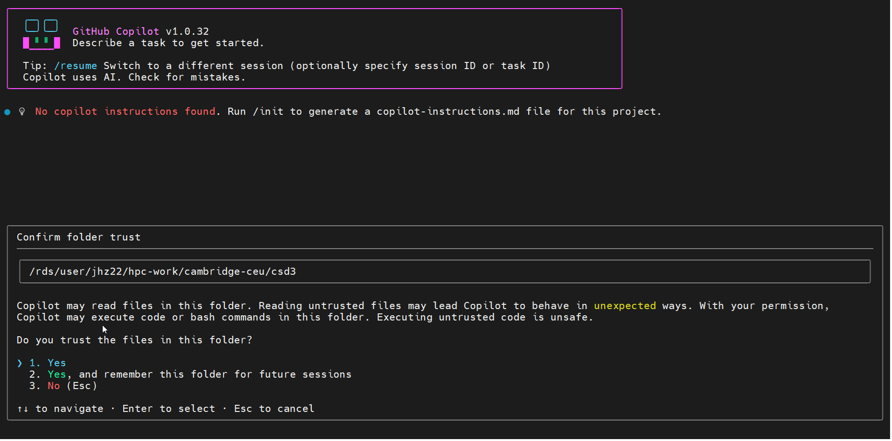

# copilot-cli

Official page: <https://www.npmjs.com/package/@github/copilot>, GitHub: <https://github.com/github/copilot-cli>

## Installation

```bash
module load ceuadmin/node
npm view @github/copilot versions --json
export version=1.0.32
npm install -g @github/copilot@$version --prefix $CEUADMIN/copilot-cli/$version
```

or alternatively,

```bash
module load ceuadmin/cli
gh release list --repo github/copilot-cli
curl -fsSL https://gh.io/copilot-install | VERSION="v1.0.32" PREFIX="$CEUADMIN/copilot-cli" bash
```

## Module file

This is analogous to ceuadmin/codex-cli.

```
#%Module -*- tcl -*-
##
## copilot-cli/1.0.32 modulefile
##

proc ModulesHelp { } {

  puts stderr "\tGitHub Copilot CLI (npm package)\n"
  puts stderr "\tProvides Copilot-related tooling for use in the terminal"
  puts stderr "\tInstalled under: /usr/local/Cluster-Apps/ceuadmin/copilot-cli/1.0.32"
  puts stderr "\tHomepage: https://www.npmjs.com/package/@github/copilot"
}

module-whatis "GitHub Copilot CLI tooling (Node.js-based)"

module load ceuadmin/node/24.15.0

set               root                 /usr/local/Cluster-Apps/ceuadmin/copilot-cli/1.0.32
prepend-path      PATH                 $root/bin

setenv            NPM_CONFIG_PREFIX    $root
setenv            NODE_PATH            $root/lib/node_modules
```

## Screenshot

We issue `copilot` and get



## Integration with Ollama

URL, <https://docs.ollama.com/integrations/copilot-cli>

```bash
ollama serve > /dev/null 2>&1 &
until ollama list; do
  sleep 1
done
ollama launch copilot --model kimi-k2.5:cloud
ollama launch copilot --model kimi-k2.5:cloud --yes -- -p "how does this repository work?"
```

Manually,

```bash
export COPILOT_PROVIDER_BASE_URL=http://localhost:11434/v1
export COPILOT_PROVIDER_API_KEY=
export COPILOT_PROVIDER_WIRE_API=responses
export COPILOT_MODEL=qwen3.5
copilot
```

or effectively,

```bash
COPILOT_PROVIDER_BASE_URL=http://localhost:11434/v1 COPILOT_PROVIDER_API_KEY= COPILOT_PROVIDER_WIRE_API=responses COPILOT_MODEL=glm-5:cloud copilot
```

The cloud models can be checked via <https://ollama.com/search?c=cloud>.
