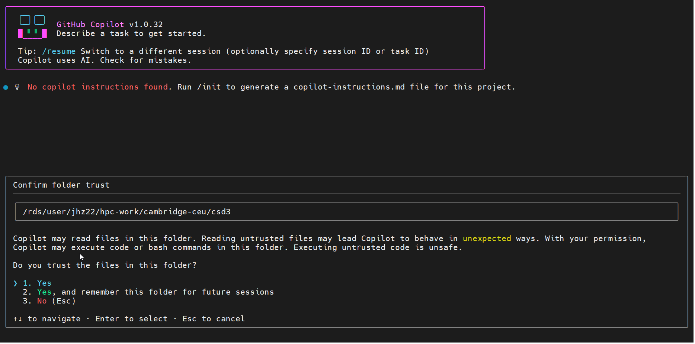

# copilot-cli

Web: 

- GitHub: <https://github.com/github/copilot-cli>
- npm, <https://www.npmjs.com/package/@github/copilot>

## 1.0.83

```bash
module load ceuadmin/node
npm view @github/copilot versions --json
export version=1.0.83
export root="$CEUADMIN/copilot-cli/$version"
# npm package
npm install -g "@github/copilot@$version" --prefix "$root"
# package/ payload
wget -qO- "https://github.com/github/copilot-cli/releases/download/v${version}/github-copilot-${version}-linux-x64.tgz" | \
    tar xzf - -C "$root"
# standalone executable
wget -qO- "https://github.com/github/copilot-cli/releases/download/v${version}/copilot-linux-x64.tar.gz" | \
    tar xzf - -C "$root"
```

We have

| Copy                     | Purpose                                                                      |
| ------------------------ | ---------------------------------------------------------------------------- |
| **Standalone `copilot`** | Truly self-contained executable; easiest fallback                            |
| **`package/` archive**   | Best for inspecting/reusing skills, agents, schemas, SDK, runtime components |
| **npm installation**     | Clean, versioned, supported installation and easiest to run/update           |

but the standalone counterpart appears to the same as in node_modules/@github/copilot-linux-x64/ so is removed.

## 1.0.32

```bash
module load ceuadmin/node
npm view @github/copilot versions --json
export version=1.0.32
npm install -g @github/copilot@$version --prefix $CEUADMIN/copilot-cli/$version
```

or alternatively,

```bash
module load ceuadmin/cli
gh release list --repo github/copilot-cli
export version=1.0.32
curl -fsSL https://gh.io/copilot-install | VERSION="v$version" PREFIX="$CEUADMIN/copilot-cli/$version" bash
```

which does not depend on node.

## Screenshot

We issue `copilot` and get



## Integration with Ollama

URL, <https://docs.ollama.com/integrations/copilot-cli>

```bash
ollama serve > /dev/null 2>&1 &
until ollama list; do
  sleep 1
done
ollama launch copilot --model kimi-k2.5:cloud
ollama launch copilot --model kimi-k2.5:cloud --yes -- -p "how does this repository work?"
```

Manually,

```bash
export COPILOT_PROVIDER_BASE_URL=http://localhost:11434/v1
export COPILOT_PROVIDER_API_KEY=
export COPILOT_PROVIDER_WIRE_API=responses
export COPILOT_MODEL=qwen3.5
copilot
```

or effectively,

```bash
COPILOT_PROVIDER_BASE_URL=http://localhost:11434/v1 COPILOT_PROVIDER_API_KEY= COPILOT_PROVIDER_WIRE_API=responses COPILOT_MODEL=glm-5:cloud copilot
```

The cloud models can be checked via <https://ollama.com/search?c=cloud>.
