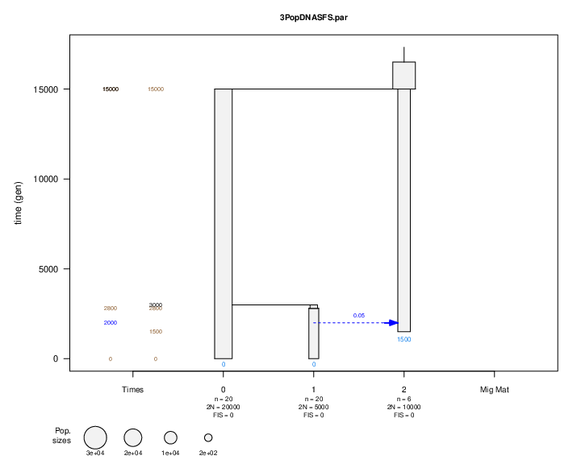

# fsc2

Web: <https://cmpg.unibe.ch/software/fastsimcoal2/>

## Installation

```bash
wget https://cmpg.unibe.ch/software/fastsimcoal2/downloads/fsc28_linux64.zip
unzip fsc28_linux64.zip
cd fsc28_linux64/
chmod +x fsc28
./fsc28
```

which gives command line options.

```
fsc was launched without any argument: attempting to read file "fsc_run.txt"
Unable to find file "fsc_run.txt" in current directory(/usr/local/Cluster-Apps/ceuadmin/fsc2/2.8.0/example files)


fastSimcoal2 (ver 2.8.0.0 - 22.09.23)

Usage:

 -h  --help              : prints this help
 -i  --ifile test.par    : name of parameter file
 -n  --numsims 1000      : number of simulations to perform
                           Also applies for parameter estimation
 -t  --tplfile test.tpl  : name of template parameter file (optional)
 -f  --dfile test.def    : name of parameter definition file (optional)
 -F  --dFile test.def    : same as -f, but only uses simple parameters defined
                           in template file. Complex params are recomputed
 -e  --estfile test.est  : parameter prior definition file (optional)
                           Parameters drawn from specified distributions are
                           substituted into template file.
 -E  --numest 10         : number of draws from parameter priors (optional)
                           Listed parameter values are substituted in template file
 -g  --genotypic         : generates arlequin projects with genotypic data
 -p  --phased            : specifies that phase is known in arlequin output
                           default: phase is unknown
 -s  --dnatosnp 2000     : output DNA as SNP data, and specify maximum no. of SNPs
                           to output (use 0 to output all SNPs).
 -S  --allsites          : output the whole DNA sequence, incl. monomorphic sites
 -I  --inf               : generates DNA mutations according to an
                           infinite site (IS) mutation model
 -d  --dsfs              : computes derived site frequency spectrum
                           (for SNP or DNA as SNP (-s) data only).
 -m  --msfs              : computes minor site frequency spectrum
                           (for SNP or DNA as SNP (-s) data only)
 -j  --jobs              : output one simulated or bootstrapped SFS per file
                           in a separate directory for easier analysis
                           (requires -d or -m and -s0 options)
 -b  --numboot 10        : number of bootstraps to perform on polymorphic sites to extract SFS
                           (should be used in addition to -s0 and -j options)
 -H  --header            : generates header in site frequency spectrum files
 -q  --quiet             : minimal message output to console
 -T  --tree              : outputs coalescent tree in nexus format
 -k  --keep  10000       : number of simulated polymorphic sites kept in memory
                           If the simulated no. is larger, then temporary files
                           are created. Default value is 10000
 -K  --numRandGen  20000 : number of random numbers generated in advance
                           Default value is 20000
 -r  --seed              : seed for random number generator (positive integer <= 1E6)
 -x  --noarloutput       : does not generate Arlequin output
 -G  --indgenot          : generates an individual genotype table
 -M  --maxlhood          : perform parameter estimation by max lhood from SFS
                           values between iterations
 -L  --numloops 20       : number of loops (ECM cycles) to perform during
                           lhood maximization. Default is 20
 -l  --minnumloops 2     : number of  loops (ECM cycles) for which the lhood is
                           computed on both monomorphic and polymorphic sites
                           if REFERENCE parameter is defined
 -C  --minSFSCount 1     : minimum observed SFS entry count taken into account in
                           likelihood computation (default = 1, but value can be < 1. e.g  0.5)
 -0  --removeZeroSFS     : do not take into account monomorphic sites for SFS
                           likelihood computation
 -a  --ascDeme 0         : This is the deme id where ascertainment is performed
                           when simulating SNPs. Default: no ascertainment.
 -A  --ascSize 2         : number of ascertained chromosomes used to define SNPs in
                           a given deme. Optional parameter. Default value is 2
 -u   --multiSFS         : generate or use multidimensional SFS
 -w   --brentol 0.01     : tolerance for Brent optimization
                           Default = 0.01. Smaller value imply more precise estimations
                           but require more computation time (min;max) = (1e-1;1e-5)
 -c   --cores 1          : number of openMP threads for parameter estimation
                           (default=1, max=numBatches, use 0 to let openMP choose optimal value)
 -B   --numBatches 12    : max. no. of batches for multi-threaded runs
                           (default=12)
 -P   --pooledsfs        : computes pooled SFS over all samples.
                           Assumes -d or -m, but not -u flag activated
      --recordMRCA       : records tMRCAs for each non recombining segment and outputs
                           results in <generic name>_mrca.txt. Beware: huge slow down of computing time
      --foldedSFS        : computes the 1D and 2D MAF SFS by simply folding the DAF SFS
      --logprecision 23  : precision for computation of logs of random numbers. Max value is 23
                           Default value is 23 (full precision). Recommended lower value is 18
      --initValues my.pv : specifies a file (*.pv) containing initial parameter values
                           for parameter optimization
      --nosingleton      : ignores singletons in likelihood computation
 -y   --resetParam 3     : Number of unsuccessful cycles before resetting parameters to current max lhood values
                           default is zero, implying no resetting
 -z   --finalRange 0.01  : Proportion of the initial search range remaining in the last cycle (default is 1)

```

## Testing

When the module is built, one can use this script.

```bash
module load ceuadmin/fsc2/2.8.0
cd examples
fsc28 -i 1PopDNA.par -n 1 -d -e
module load ceadmin/R
wget https://cmpg.unibe.ch/software/fastsimcoal2/R/ParFileViewer.r
Rscript ParFileViewer.r 1PopDNA.par
Rscript ParFileViewer.r 3PopDNASFS.par
convert 3PopDNASFS.par.pdf 3PopDNASFS.png

```

where an R utility is used to visually inspect the validity of modeled scenarios, [3PopDNASFS.png](files/3PopDNASFS.png).



## References

Excoffier L, et al. _fastsimcoal2: demographic inference under complex evolutionary scenarios_. _Bioinformatics_ 37 (24):4882–4885, 2021.
