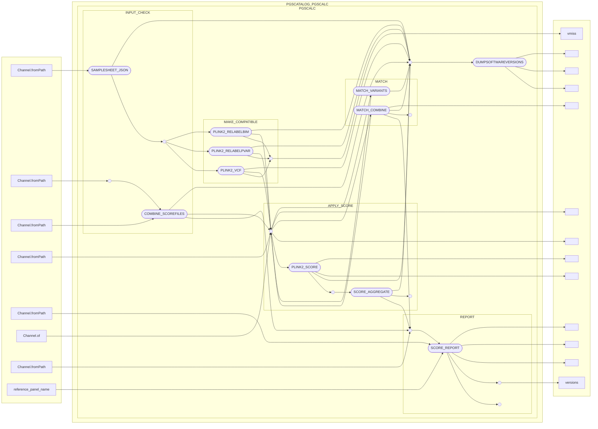

# pgsc_calc

Web: <https://pgsc-calc.readthedocs.io/en/latest/> ([GitHub](https://github.com/PGScatalog/pgsc_calc), [ftp](https://ftp.ebi.ac.uk/pub/databases/spot/pgs/))

## 2.0.0

The `ceuamdin/pgsc_calc/2.0.0` module is built as follows,

```bash
cd $CEUADMIN/pgsc_calc
mkdir 2.0.0
wget -qO- https://github.com/PGScatalog/pgsc_calc/archive/refs/tags/v2.0.0.tar.gz | \
tar xvz -C 2.0.0 --strip-components=1
cd 2.0.0
module load python/3.11.0-icl
virtualenv venv
source venv/bin/activate
pip install hypothesis pytest-workflow pandas requests
module load ceuadmin/singularity/4.0.3
module load ceuadmin/ncurses/6.3
module load curl/7.79.0/gcc/75dxv7ac
curl -s https://get.nextflow.io | bash
./nextflow pull pgscatalog/pgsc_calc
export NXF_SINGULARITY_CACHEDIR=work
./nextflow run pgscatalog/pgsc_calc -profile test,singularity
nextflow run pgscatalog/pgsc_calc -profile singularity --input samplesheet.csv --pgs_id PGS001229 --target_build GRCh37
deactivate
```

The source package has a `Makefile` which sets default to `docker`, but on CSD3 it is more straightforward with `singularity` pulled
by `nextflow` via `curl`. Note that during setup, recent changes at CSD3 require the long-missed prefix `./` but it is unnecessary later.

Screen output form the test run (`nextflow run pgscatalog/pgsc_calc -profile test,singularity`) is again pasted here,

```
nextflow run pgscatalog/pgsc_calc -profile test,singularity

 N E X T F L O W   ~  version 24.10.1

Pulling pgscatalog/pgsc_calc ...
 downloaded from https://github.com/PGScatalog/pgsc_calc.git
Launching `https://github.com/pgscatalog/pgsc_calc` [mad_galileo] DSL2 - revision: 205cbfd1f5 [main]

Downloading plugin nf-schema@2.0.0
Downloading plugin nf-prov@1.2.2

INFO: The test profile is used to install the workflow and verify the software is working correctly on your system.
INFO: Test input data and results are are only useful as examples of outputs, and are not biologically meaningful.


------------------------------------------------------
  pgscatalog/pgsc_calc v2.0.0-g205cbfd
------------------------------------------------------
Core Nextflow options
  revision       : main
  runName        : mad_galileo
  containerEngine: singularity
  launchDir      : /rds/user/jhz22/hpc-work/work
  workDir        : /rds/user/jhz22/hpc-work/work/work
  projectDir     : /rds/user/jhz22/hpc-work/work/assets/pgscatalog/pgsc_calc
  userName       : jhz22
  profile        : test,singularity
  configFiles    :

!! Only displaying parameters that differ from the pipeline defaults !!
------------------------------------------------------
If you use pgscatalog/pgsc_calc for your analysis please cite:

* The Polygenic Score Catalog
  https://doi.org/10.1101/2024.05.29.24307783
  https://doi.org/10.1038/s41588-021-00783-5

* The nf-core framework
  https://doi.org/10.1038/s41587-020-0439-x

* Software dependencies
  https://github.com/pgscatalog/pgsc_calc/blob/main/CITATIONS.md

[-        ] PGSCATALOG_PGSCCALC:PGSCCALC:INPUT_CHECK:COMBINE_SCOREFILES     -
[-        ] PGSCATALOG_PGSCCALC:PGSCCALC:MAKE_COMPATIBLE:PLINK2_RELABELBIM  -
[-        ] PGSCATALOG_PGSCCALC:PGSCCALC:INPUT_CHECK:COMBINE_SCOREFILES     -
[-        ] PGSCATALOG_PGSCCALC:PGSCCALC:MAKE_COMPATIBLE:PLINK2_RELABELBIM  -
executor >  local (1)
[-        ] PGSCATALOG_PGSCCALC:PGSCCALC:INPUT_CHECK:COMBINE_SCOREFILES                            -
executor >  local (1)
[-        ] PGSCATALOG_PGSCCALC:PGSCCALC:INPUT_CHECK:COMBINE_SCOREFILES                            -
executor >  local (2)
[ed/1ea035] PGSCATALOG_PGSCCALC:PGSCCALC:INPUT_CHECK:COMBINE_SCOREFILES (1)                        [  0%] 0 of 1
executor >  local (3)
[ed/1ea035] PGSCATALOG_PGSCCALC:PGSCCALC:INPUT_CHECK:COMBINE_SCOREFILES (1)                        [100%] 1 of 1 ✔
executor >  local (3)
[ed/1ea035] PGSCATALOG_PGSCCALC:PGSCCALC:INPUT_CHECK:COMBINE_SCOREFILES (1)                        [100%] 1 of 1 ✔
executor >  local (3)
[ed/1ea035] PGSCATALOG_PGSCCALC:PGSCCALC:INPUT_CHECK:COMBINE_SCOREFILES (1)                        [100%] 1 of 1 ✔
executor >  local (4)
[ed/1ea035] PGSCATALOG_PGSCCALC:PGSCCALC:INPUT_CHECK:COMBINE_SCOREFILES (1)                        [100%] 1 of 1 ✔
executor >  local (5)
[ed/1ea035] PGSCATALOG_PGSCCALC:PGSCCALC:INPUT_CHECK:COMBINE_SCOREFILES (1)                                [100%] 1 of 1 ✔
executor >  local (6)
[ed/1ea035] PGSCATALOG_PGSCCALC:PGSCCALC:INPUT_CHECK:COMBINE_SCOREFILES (1)                                [100%] 1 of 1 ✔
executor >  local (6)
[ed/1ea035] PGSCATALOG_PGSCCALC:PGSCCALC:INPUT_CHECK:COMBINE_SCOREFILES (1)                                [100%] 1 of 1 ✔
executor >  local (7)
[ed/1ea035] PGSCATALOG_PGSCCALC:PGSCCALC:INPUT_CHECK:COMBINE_SCOREFILES (1)                                [100%] 1 of 1 ✔
executor >  local (7)
[ed/1ea035] PGSCATALOG_PGSCCALC:PGSCCALC:INPUT_CHECK:COMBINE_SCOREFILES (1)                                [100%] 1 of 1 ✔
[-        ] PGSCATALOG_PGSCCALC:PGSCCALC:MAKE_COMPATIBLE:PLINK2_RELABELBIM                                 -
[ad/e17692] PGSCATALOG_PGSCCALC:PGSCCALC:MAKE_COMPATIBLE:PLINK2_RELABELPVAR (cineca chromosome 22)         [100%] 1 of 1 ✔
executor >  local (8)
[ed/1ea035] PGSCATALOG_PGSCCALC:PGSCCALC:INPUT_CHECK:COMBINE_SCOREFILES (1)                                [100%] 1 of 1 ✔
[-        ] PGSCATALOG_PGSCCALC:PGSCCALC:MAKE_COMPATIBLE:PLINK2_RELABELBIM                                 -
[ad/e17692] PGSCATALOG_PGSCCALC:PGSCCALC:MAKE_COMPATIBLE:PLINK2_RELABELPVAR (cineca chromosome 22)         [100%] 1 of 1 ✔
executor >  local (8)
[ed/1ea035] PGSCATALOG_PGSCCALC:PGSCCALC:INPUT_CHECK:COMBINE_SCOREFILES (1)                                [100%] 1 of 1 ✔
[-        ] PGSCATALOG_PGSCCALC:PGSCCALC:MAKE_COMPATIBLE:PLINK2_RELABELBIM                                 -
[ad/e17692] PGSCATALOG_PGSCCALC:PGSCCALC:MAKE_COMPATIBLE:PLINK2_RELABELPVAR (cineca chromosome 22)         [100%] 1 of 1 ✔
executor >  local (9)
[ed/1ea035] PGSCATALOG_PGSCCALC:PGSCCALC:INPUT_CHECK:COMBINE_SCOREFILES (1)                                [100%] 1 of 1 ✔
executor >  local (9)
[ed/1ea035] PGSCATALOG_PGSCCALC:PGSCCALC:INPUT_CHECK:COMBINE_SCOREFILES (1)                                [100%] 1 of 1 ✔
executor >  local (9)
[ed/1ea035] PGSCATALOG_PGSCCALC:PGSCCALC:INPUT_CHECK:COMBINE_SCOREFILES (1)                                [100%] 1 of 1 ✔
executor >  local (9)
[ed/1ea035] PGSCATALOG_PGSCCALC:PGSCCALC:INPUT_CHECK:COMBINE_SCOREFILES (1)                                [100%] 1 of 1 ✔
[-        ] PGSCATALOG_PGSCCALC:PGSCCALC:MAKE_COMPATIBLE:PLINK2_RELABELBIM                                 -
[ad/e17692] PGSCATALOG_PGSCCALC:PGSCCALC:MAKE_COMPATIBLE:PLINK2_RELABELPVAR (cineca chromosome 22)         [100%] 1 of 1 ✔
[-        ] PGSCATALOG_PGSCCALC:PGSCCALC:MAKE_COMPATIBLE:PLINK2_VCF                                        -
[59/d4a83e] PGSCATALOG_PGSCCALC:PGSCCALC:MATCH:MATCH_VARIANTS (cineca chromosome 22)                       [100%] 1 of 1 ✔
[e3/ec2a3c] PGSCATALOG_PGSCCALC:PGSCCALC:MATCH:MATCH_COMBINE (cineca)                                      [100%] 1 of 1 ✔
[d3/19be98] PGS…G_PGSCCALC:PGSCCALC:APPLY_SCORE:PLINK2_SCORE (cineca chromosome 22 effect type additive 0) [100%] 2 of 2 ✔
[ab/d57ff4] PGSCATALOG_PGSCCALC:PGSCCALC:APPLY_SCORE:SCORE_AGGREGATE (cineca)                              [100%] 1 of 1 ✔
[ca/289259] PGSCATALOG_PGSCCALC:PGSCCALC:REPORT:SCORE_REPORT (cineca)                                      [100%] 1 of 1 ✔
[02/588836] PGSCATALOG_PGSCCALC:PGSCCALC:DUMPSOFTWAREVERSIONS (1)                                          [100%] 1 of 1 ✔
Pulling Singularity image oras://ghcr.io/pgscatalog/report:2-beta-singularity [cache /rds/user/jhz22/hpc-work/work/ghcr.io-pgscatalog-report-2-beta-singularity.img]
Pulling Singularity image oras://ghcr.io/pgscatalog/pyyaml:6.0-singularity [cache /rds/user/jhz22/hpc-work/work/ghcr.io-pgscatalog-pyyaml-6.0-singularity.img]
-[pgscatalog/pgsc_calc] Pipeline completed successfully-
Completed at: 27-Nov-2024 08:04:14
Duration    : 1m 6s
CPU hours   : (a few seconds)
Succeeded   : 9
```

Note the working directory is `/rds/user/CRSid/hpc-work/work`. A copy of the [report.html](files/report-2.0.0.html) is also made available.

## 2.0.0-alpha.4

### Prerequistes

This is furnished by a number of modules,

```bash
module load ceuadmin/Anaconda3/2023.09-0
module load ceuadmin/fraposa_pgsc/0.1.0
module load ceuadmin/go/1.21.6
module load ceuadmin/nextflow/23.10.1
module load ceuadmin/openjdk/11.0.20+8
module load ceuadmin/plink/2.00a3.3
module load ceuadmin/quarto/1.4.549
module load ceuadmin/R/latest
module load ceuadmin/singularity/4.0.3
```

Under icelake, one can use `ceuadmin/quarto/1.3.450-icelake`[^issue] and `R/4.3.1-icelake`. Handling of specific modules is documented on the ceuadmin section when appropriate.

### pgsc_calc

As of 31 January 2024, 2.0.0-alpha.4 is the latest.

```bash
mkdir -p $CEUADMIN/pgsc_calc && cd $CEUADMIN/pgsc_calc
wget -qO- https://github.com/PGScatalog/pgsc_calc/archive/refs/tags/v2.0.0-alpha.4.tar.gz | \
tar xvfz -
mv pgsc_calc-2.0.0-alpha.4/ 2.0.0-alpha.4/
```

### CSD3 (ceuadmin) modules

These are `pgsc_calc/2.0.0-alpha.4` and `pgsc_calc/2.0.0-alpha.4-icelake` (experimental) built from the two steps above; the icelake version allows for the possibility to use an indepeendent collection of R packages via `$R_LIBS`, say vctrs[^vctrs].

## Usage: benchmark

This is done as follows,

```
module load ceuadmin/pgsc_calc
export NXF_HOME=/rds/user/$USER/hpc-work/work
export DENO_HOME=/home/$USER/.cache/deno/gen
export QUARTO_HOME=/home/$USER/.cache/quarto
cd $NXF_HOME
nextflow run pgscatalog/pgsc_calc -profile test,singularity
nextflow run pgscatalog/pgsc_calc -profile test,singularity -c b.config
```

NXF_HOME=/home/$USER/.nextflow[^config] without the -c option, which allows for additional configurations, e.g.:

```
singularity {
  enabled = true
  autoMounts = true
  runOptions = '-B $NXF_HOME -B $DENO_HOME -B $QUARTO_HOME'
}
```

For convenience, the three environmental variables have been defined with the module.

### Directed acyclic graph (DAG)

<script type="module">
  import mermaid from 'https://cdn.jsdelivr.net/npm/mermaid@10/dist/mermaid.esm.min.mjs';
  mermaid.initialize({ startOnLoad: true });
</script>

Shown here is from left to right instead -- refresh screen to fit if necessary,



### Screen output

```
N E X T F L O W  ~  version 23.10.1
Pulling pgscatalog/pgsc_calc ...
 downloaded from https://github.com/PGScatalog/pgsc_calc.git
Launching `https://github.com/pgscatalog/pgsc_calc` [stupefied_cray] DSL2 - revision: 83326a1e60 [main]

WARN: Found unexpected parameters:
* --config_profile_description: Minimal test dataset to check pipeline function
* --config_profile_name: Test profile
* --ref_format_version: v0.1
* --ancestry_checksums: /rds/user/jhz22/hpc-work/work/assets/pgscatalog/pgsc_calc/assets/ancestry/checksums.txt
- Ignore this warning: params.schema_ignore_params = "config_profile_description,config_profile_name,ref_format_version,ancestry_checksums"


------------------------------------------------------
  pgscatalog/pgsc_calc v2.0.0-alpha.4
------------------------------------------------------
Core Nextflow options
  revision          : main
  runName           : stupefied_cray
  containerEngine   : singularity
  launchDir         : /rds/user/jhz22/hpc-work/work
  workDir           : /rds/user/jhz22/hpc-work/work/work
  projectDir        : /rds/user/jhz22/hpc-work/work/assets/pgscatalog/pgsc_calc
  userName          : jhz22
  profile           : test,singularity
  configFiles       : /rds/user/jhz22/hpc-work/work/assets/pgscatalog/pgsc_calc/nextflow.config, /usr/local/Cluster-Apps/ceuadmin/pgsc_calc/tests/b.config

Input/output options
  input             : /rds/user/jhz22/hpc-work/work/assets/pgscatalog/pgsc_calc/assets/examples/samplesheet.csv
  scorefile         : /rds/user/jhz22/hpc-work/work/assets/pgscatalog/pgsc_calc/assets/examples/scorefiles/PGS001229_22.txt
  genotypes_cache   : null
  outdir            : /rds/user/jhz22/hpc-work/work/assets/pgscatalog/pgsc_calc/results

Reference options
  run_ancestry      : null
  ref_samplesheet   : /rds/user/jhz22/hpc-work/work/assets/pgscatalog/pgsc_calc/assets/ancestry/reference.csv
  ld_grch37         : /rds/user/jhz22/hpc-work/work/assets/pgscatalog/pgsc_calc/assets/ancestry/high-LD-regions-hg19-GRCh37.txt
  ld_grch38         : /rds/user/jhz22/hpc-work/work/assets/pgscatalog/pgsc_calc/assets/ancestry/high-LD-regions-hg38-GRCh38.txt

Compatibility options
  target_build      : GRCh37

Max job request options
  max_cpus          : 2
  max_memory        : 6.GB
  max_time          : 6.h

Generic options
  tracedir          : ./results/pipeline_info

Other parameters
  ancestry_checksums: /rds/user/jhz22/hpc-work/work/assets/pgscatalog/pgsc_calc/assets/ancestry/checksums.txt

!! Only displaying parameters that differ from the pipeline defaults !!
------------------------------------------------------
If you use pgscatalog/pgsc_calc for your analysis please cite:

* The Polygenic Score Catalog
  https://doi.org/10.1038/s41588-021-00783-5

* The nf-core framework
  https://doi.org/10.1038/s41587-020-0439-x

* Software dependencies
  https://github.com/pgscatalog/pgsc_calc/blob/master/CITATIONS.md
------------------------------------------------------
[-        ] process > PGSCATALOG_PGSCALC:PGSCALC:INPUT_CHECK:SAMPLESHEET_JSON       -
executor >  local (1)
executor >  local (2)
executor >  local (2)
executor >  local (3)
executor >  local (4)
executor >  local (4)
executor >  local (5)
executor >  local (6)
executor >  local (7)
executor >  local (7)
[c6/45eaa6] process > PGSCATALOG_PGSCALC:PGSCALC:INPUT_CHECK:SAMPLESHEET_JSON (samplesheet.csv)                         [100%] 1 of 1 ✔
executor >  local (7)
[c6/45eaa6] process > PGSCATALOG_PGSCALC:PGSCALC:INPUT_CHECK:SAMPLESHEET_JSON (samplesheet.csv)                         [100%] 1 of 1 ✔
executor >  local (8)
[c6/45eaa6] process > PGSCATALOG_PGSCALC:PGSCALC:INPUT_CHECK:SAMPLESHEET_JSON (samplesheet.csv)                         [100%] 1 of 1 ✔
executor >  local (8)
[c6/45eaa6] process > PGSCATALOG_PGSCALC:PGSCALC:INPUT_CHECK:SAMPLESHEET_JSON (samplesheet.csv)                         [100%] 1 of 1 ✔
executor >  local (9)
[c6/45eaa6] process > PGSCATALOG_PGSCALC:PGSCALC:INPUT_CHECK:SAMPLESHEET_JSON (samplesheet.csv)                         [100%] 1 of 1 ✔
executor >  local (9)
[c6/45eaa6] process > PGSCATALOG_PGSCALC:PGSCALC:INPUT_CHECK:SAMPLESHEET_JSON (samplesheet.csv)                         [100%] 1 of 1 ✔
executor >  local (9)
[c6/45eaa6] process > PGSCATALOG_PGSCALC:PGSCALC:INPUT_CHECK:SAMPLESHEET_JSON (samplesheet.csv)                         [100%] 1 of 1 ✔
executor >  local (9)
[c6/45eaa6] process > PGSCATALOG_PGSCALC:PGSCALC:INPUT_CHECK:SAMPLESHEET_JSON (samplesheet.csv)                         [100%] 1 of 1 ✔
[25/1dbd87] process > PGSCATALOG_PGSCALC:PGSCALC:INPUT_CHECK:COMBINE_SCOREFILES (1)                                     [100%] 1 of 1 ✔
[-        ] process > PGSCATALOG_PGSCALC:PGSCALC:MAKE_COMPATIBLE:PLINK2_RELABELBIM                                      -
[5d/8952b5] process > PGSCATALOG_PGSCALC:PGSCALC:MAKE_COMPATIBLE:PLINK2_RELABELPVAR (cineca chromosome 22)              [100%] 1 of 1 ✔
[-        ] process > PGSCATALOG_PGSCALC:PGSCALC:MAKE_COMPATIBLE:PLINK2_VCF                                             -
[0b/b2699f] process > PGSCATALOG_PGSCALC:PGSCALC:MATCH:MATCH_VARIANTS (cineca chromosome 22)                            [100%] 1 of 1 ✔
[12/113b82] process > PGSCATALOG_PGSCALC:PGSCALC:MATCH:MATCH_COMBINE (cineca)                                           [100%] 1 of 1 ✔
[e2/e5866c] process > PGSCATALOG_PGSCALC:PGSCALC:APPLY_SCORE:PLINK2_SCORE (cineca chromosome 22 effect type additive 0) [100%] 1 of 1 ✔
[58/28ad9d] process > PGSCATALOG_PGSCALC:PGSCALC:APPLY_SCORE:SCORE_AGGREGATE (cineca)                                   [100%] 1 of 1 ✔
[4c/32e9ee] process > PGSCATALOG_PGSCALC:PGSCALC:REPORT:SCORE_REPORT (cineca)                                           [100%] 1 of 1 ✔
[38/951766] process > PGSCATALOG_PGSCALC:PGSCALC:DUMPSOFTWAREVERSIONS (1)                                               [100%] 1 of 1 ✔
Pulling Singularity image oras://ghcr.io/pgscatalog/pgscatalog_utils:v0.4.3-singularity [cache /rds/user/jhz22/hpc-work/work/ghcr.io-pgscatalog-pgscatalog_utils-v0.4.3-singularity.img]
Pulling Singularity image oras://ghcr.io/pgscatalog/plink2:2.00a3.3-singularity [cache /rds/user/jhz22/hpc-work/work/ghcr.io-pgscatalog-plink2-2.00a3.3-singularity.img]
Pulling Singularity image oras://dockerhub.ebi.ac.uk/gdp-public/pgsc_calc/singularity/report:2.0 [cache /rds/user/jhz22/hpc-work/work/dockerhub.ebi.ac.uk-gdp-public-pgsc_calc-singularity-report-2.0.img]
Pulling Singularity image oras://ghcr.io/pgscatalog/pyyaml:6.0-singularity [cache /rds/user/jhz22/hpc-work/work/ghcr.io-pgscatalog-pyyaml-6.0-singularity.img]
-[pgscatalog/pgsc_calc] Pipeline completed successfully-
Please remember to cite polygenic score authors if you publish with them!
Check the output report for citation details
```

### Report

This is [report.html](files/report.html)[^report], which is rendered from [report.qmd](files/report.qmd) at `assets/pgscatalog/pgsc_calc/assets/report/*`.

```bash
quarto render report.qmd -M "self-contained:true" -P score_path:aggregated_scores.txt.gz -P sampleset:cineca -P run_ancestry:false -P reference_panel_name:NO_PANEL
```

It is handy to have all options of quarto render listed here,

```
  Usage:   quarto render [input] [args...]
  Version: 1.4.549

  Description:

    Render files or projects to various document types.

  Options:

    -h, --help                          - Show this help.
    -t, --to                            - Specify output format(s).
    -o, --output                        - Write output to FILE (use '--output -' for stdout).
    --output-dir                        - Write output to DIR (path is input/project relative)
    -M, --metadata                      - Metadata value (KEY:VALUE).
    --site-url                          - Override site-url for website or book output
    --execute                           - Execute code (--no-execute to skip execution).
    -P, --execute-param                 - Execution parameter (KEY:VALUE).
    --execute-params                    - YAML file with execution parameters.
    --execute-dir                       - Working directory for code execution.
    --execute-daemon                    - Keep Jupyter kernel alive (defaults to 300 seconds).
    --execute-daemon-restart            - Restart keepalive Jupyter kernel before render.
    --execute-debug                     - Show debug output when executing computations.
    --use-freezer                       - Force use of frozen computations for an incremental file render.
    --cache                             - Cache execution output (--no-cache to prevent cache).
    --cache-refresh                     - Force refresh of execution cache.
    --no-clean                          - Do not clean project output-dir prior to render
    --debug                             - Leave intermediate files in place after render.
    pandoc-args...                      - Additional pandoc command line arguments.
    --log                     <file>    - Path to log file
    --log-level               <level>   - Log level (info, warning, error, critical)
    --log-format              <format>  - Log format (plain, json-stream)
    --quiet                             - Suppress console output.
    --profile                           - Active project profile(s)

  Commands:

    help  [command]  - Show this help or the help of a sub-command.

  Examples:

    Render Markdown:    quarto render document.qmd
                        quarto render document.qmd --to html
                        quarto render document.qmd --to pdf --toc
    Render Notebook:    quarto render notebook.ipynb
                        quarto render notebook.ipynb --to docx
                        quarto render notebook.ipynb --to pdf --toc
    Render Project:     quarto render
                        quarto render projdir
    Render w/ Metadata: quarto render document.qmd -M echo:false
                        quarto render document.qmd -M code-fold:true
    Render to Stdout:   quarto render document.qmd --output -
```

## References

Lambert, S. A., et al. (2021). "The Polygenic Score Catalog as an open database for reproducibility and systematic evaluation." Nature Genetics 53(4): 420-425, <https://doi.org/10.1038/s41588-021-00783-5>

[^issue]: **issues**

    It appears problematic with the Internet under icelake and with GLIBC_2.18 due to deno as in `ceuadmin/deno/1.40.2-icelake`, but now fixed as `ceuadmin/deno/1.40.2`.

    An attempt was made for `ceuadmin/glibc/2.18|2.55`, but this could be very complex.

    ```bash
    export version=2.18
    wget -qO- https://ftp.gnu.org/gnu/glibc/glibc-${version}.tar.gz | \
    tar xvfz -
    mkdir ${version}
    mv glibc-${version}/ src
    mv src ${version}
    cd ${version}/src
    module load texinfo-6.5-gcc-5.4.0-vxuomb7 binutils/2.25 texlive/2015 gcc/6
    mkdir build && cd build
    ../configure --prefix=${CEUADMIN}/glibc/${version}
    make install
    ```

    The usual `prepend-path` for modules somehow will purge modules, so `append-path` is used instead (effectively dysfunctional but providing the information) in definition of the module file.

[^config]: **config**

    By default, NXF_HOME=/home/$USER/.nextflow but works well with NXF_SINGULARITY_CACHEDIR=/rds/user/$USER/hpc-work/work (could be used as NXF_HOME as well).

[^vctrs]: **vctrs**

    Vector Helpers: <https://vctrs.r-lib.org/> ([CRAN](https://cran.r-project.org/web/packages/vctrs/index.html))

[^report]: **report**

    At least vctrs 0.6.4 is required.
