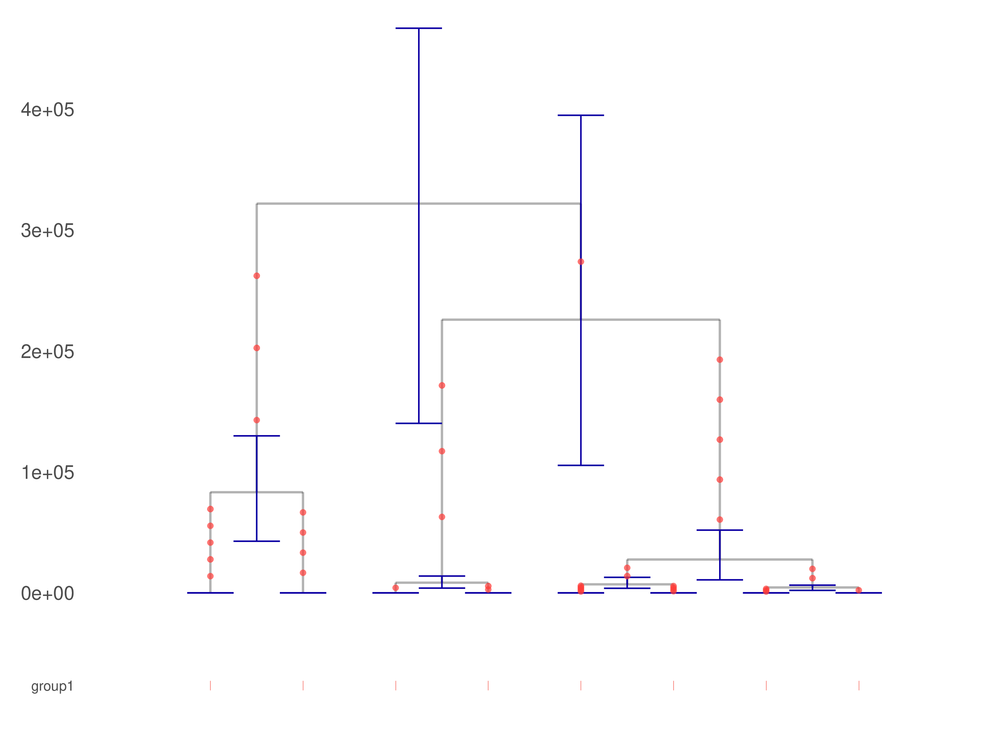

# Relate

Web: <https://myersgroup.github.io/relate/>

## 1.2.3

Firefox / 142.0 would lose part of the files, and Chrome is used instead. Both dynamic and static distributions work well under CSD3.

Besides defining an evironmental variable PATH_TO_RELATE, `ceuadmin/R/latest` is also called in the module definition.

## Testing

A well-organised `run-relate.sh` can be started from example/ directory; the last two code chunks are used here.

```bash
module load ceuadmin/relate
cd example
${PATH_TO_RELATE}/scripts/SampleBranchLengths/SampleBranchLengths.sh \
        -i example \
        -o example_bypop_sampled \
        -m 1.25e-8 \
        --coal example_bypop.coal \
        --first_bp 199990000 \
        --last_bp 200010000 \
        --seed 1 \
        --num_samples 100

${PATH_TO_RELATE}/scripts/TreeView/TreeViewSample.sh \
        --haps ./data/example.haps.gz \
        --sample ./data/example.sample.gz \
        --anc example_bypop_sampled.anc \
        --mut example_bypop_sampled.mut \
        --bp_of_interest 200000000 \
        --years_per_gen 28 \
        --poplabels ./data/example.poplabels \
        --dist example_bypop_sampled.dist \
        -o plot
convert plot.pdf relate-plot.png
```

where the module mirrors the definition in `run-relate.sh` with the named global variable `PATH_TO_RELATE`. Internally, the second chunk here calls R/ggplot2 for plot.pdf, which is converted by ImageMagick to [relate-plot.png](files/relate-plot.png)



and shown above.

## References

Liu X, et al. Selection at the *GSDMC* locus in horses and its implications for human mobility. *Science* 389: 925-930 (2025). <https://www.science.org/doi/10.1126/science.adp4581>.

Speidel, L, et al. A method for genome-wide genealogy estimation for thousands of samples. *Nat Genet* 51: 1321–1329 (2019). <https://doi.org/10.1038/s41588-019-0484-x>

Speidel L, et al., Inferring population histories for ancient genomes Using genome-Wide genealogies. *Mol Biol Evol* 38 (9): 3497–3511, 2021, <https://doi.org/10.1093/molbev/msab174>
