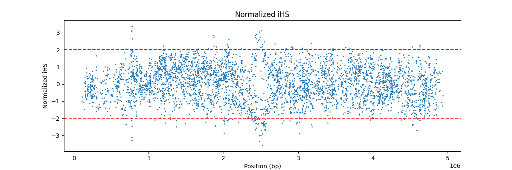
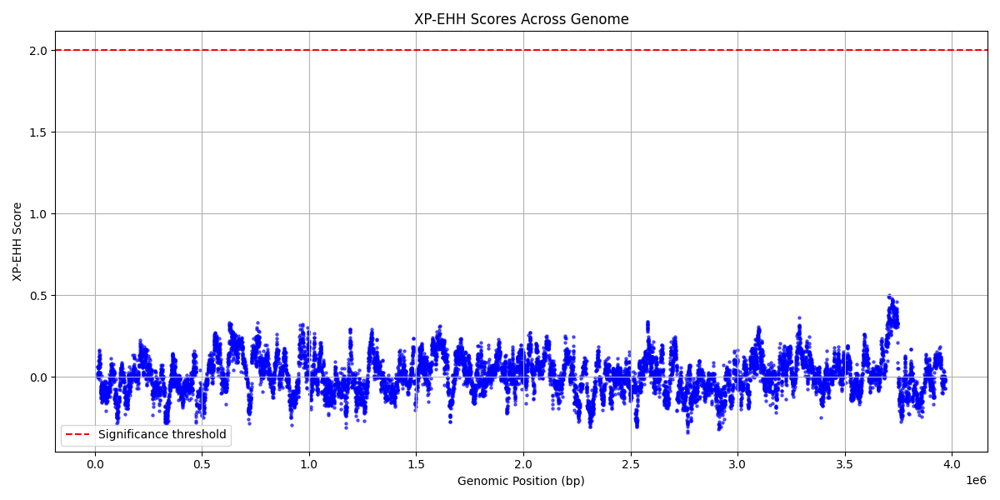

# selscan

GitHub: <https://github.com/szpiech/selscan>

## 2.1

### Installation

```bash
wget -qO- https://github.com/szpiech/selscan/archive/refs/tags/v2.1.tar.gz | tar xfz -
cd selscan-2.1/src/
make -f Makefile_linux
```

Note that although the release provides Linux executables, there are errors with GLIBC so it has to be compiled.

### Testing

We can employ the example data,

```bash
module load ceuadmin/selscan
cd example/
# integrated haplotype score
selscan --ihs --hap example.hap --map example.map --out example_ihs --threads 4
# normalization
norm --ihs --bins 100 --files example_ihs.ihs.out --log example_ihs.log
```

giving `example_ihs.ihs.out` and `example_ihs.ihs.out.norm`, respectively; the latter can be visualized via Python after
`source ~/rds/software/py3.11/bin/activate`.

```python
import pandas as pd
import matplotlib.pyplot as plt

cols = ['Locus', 'Position', 'Genetic_Map', 'Raw_iHS', 'Stat1', 'Stat2', 'Normalized_iHS', 'Flag']

df = pd.read_csv("example_ihs.ihs.out.100bins.norm", sep="\t", header=None, names=cols)

# Plot Normalized iHS vs Position
plt.figure(figsize=(12,4))
plt.scatter(df['Position'], df['Normalized_iHS'], s=1)
plt.axhline(2, color='red', linestyle='--')
plt.axhline(-2, color='red', linestyle='--')
plt.title("Normalized iHS")
plt.xlabel("Position (bp)")
plt.ylabel("Normalized iHS")
plt.show()
```

for .

XP-EHH can also be furnished,

```bash
selscan --xpehh \
  --hap example2.p1.hap \
  --ref example2.p2.hap \
  --thap example2.p1.thap \
  --thap-ref example2.p2.thap \
  --map example2.map \
  --out example2_xpehh_fixed \
  --threads 4 \
  --keep-low-freq
```

giving `example2_xpehh_fixed.xpehh.out`, which can be visualised with

```python
import pandas as pd
import matplotlib.pyplot as plt

# Load the file, first row is header
df = pd.read_csv('example2_xpehh_fixed.xpehh.out', sep='\t', header=0)

# Check the columns
print(df.columns)
print(df.head())

# Now plot using actual column names
plt.figure(figsize=(12,6))
plt.scatter(df['pos'], df['xpehh'], s=5, color='blue', alpha=0.6)  # 'pos' and 'xpehh' as per header
plt.xlabel('Genomic Position (bp)')
plt.ylabel('XP-EHH Score')
plt.title('XP-EHH Scores Across Genome')
plt.grid(True)

# Add threshold line (optional)
plt.axhline(y=2, color='red', linestyle='--', label='Significance threshold')
plt.legend()

plt.tight_layout()
plt.show()
```

for .

### Verification pipeline

This is implemented in snakemke but minor changes are necessary.

```bash
module load ceuadmin/snakemake/9.9.0-miniforge3
module load ceuadmin/R
cd verification_pipeline
sed -i 's|/Users/amatur/code/selscan/|~/rds/software/selscan-2.1/|' config.yaml
sed -i 's|/Users/amatur/code/selscan-amatur-main/bin/macos/||' Snakefile
snakemake --cores 4
```

giving output_sb/, output_sc/ and output/ containing files on ihs and nsl.
