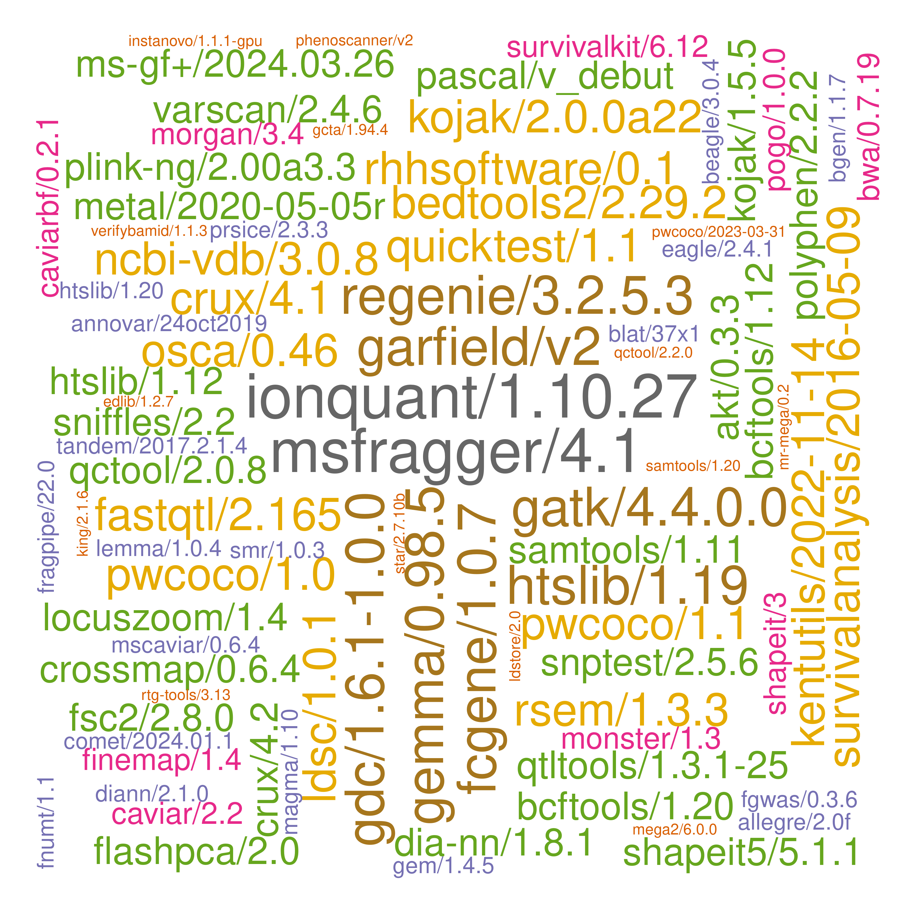
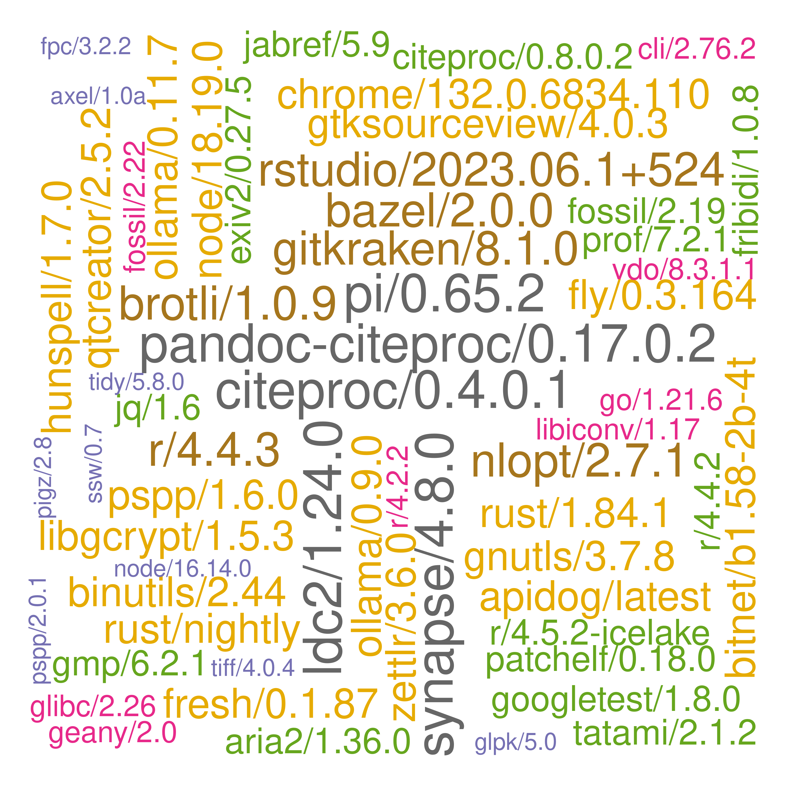

# ceuadmin

The CEU software repository is here, **/usr/local/Cluster-Apps/ceuadmin/** (CEUADMIN).


Some source packages are kept at `/rds/project/rds-4o5vpvAowP0/software` (~/rds/software if defined).

## Entries

The current list is as follows,

```
  [1] "ABCtoolbox"             "akt"                    "allegro"                "alpine"
  [5] "alsa-lib"               "Anaconda2"              "Anaconda3"              "angsd"
  [9] "annovar"                "AnythingLLMDesktop"     "apidog"                 "aria2"
 [13] "augeas"                 "autoconf"               "automake"               "awscli"
 [17] "axel"                   "bazel"                  "bcftools"               "Beagle"
 [21] "bedops"                 "bedtools2"              "bgen"                   "binutils"
 [25] "biobank"                "BitNet"                 "blat"                   "boltlmm"
 [29] "boost"                  "brotli"                 "busybox"                "BWA"
 [33] "C2S-Scale"              "caddy"                  "CaVEMaN"                "CAVIAR"
 [37] "CAVIARBF"               "cbindgen"               "ccal"                   "ccphylo"
 [41] "chrome"                 "chromium"               "circos"                 "citeproc"
 [45] "clang"                  "cli"                    "clues2"                 "cmake"
 [49] "cmocka"                 "comet"                  "cppunit"                "crossmap"
 [53] "crux"                   "cryptopp"               "cryptsetup"             "curl"
 [57] "Cytoscape"              "delphi"                 "deno"                   "DEPICT"
 [61] "device-mapper"          "diann"                  "DjVuLibre"              "docbook2X"
 [65] "docker"                 "DosageConverter"        "dotnet"                 "DrugAssist"
 [69] "dump_syms"              "Eagle"                  "edge"                   "edit"
 [73] "edlib"                  "enchant"                "ensembl-vep"            "exiv2"
 [77] "exomeplus"              "expat"                  "FastQTL"                "fcGENE"
 [81] "ffmpeg"                 "fgwas"                  "findlib"                "finemap"
 [85] "firefox"                "FlashLFQ"               "flashpca"               "fly"
 [89] "fNUMT"                  "fossil"                 "fpc"                    "FragPipe"
 [93] "fraposa_pgsc"           "freesurfer"             "fresh"                  "fribidi"
 [97] "fsc2"                   "GARFIELD"               "gatk"                   "gcc"
[101] "gcc-toolset"            "gcloud"                 "gcta"                   "gdal"
[105] "gdc"                    "geany"                  "GEM"                    "GEMMA"
[109] "GENIE"                  "Genotype-Harmonizer"    "geos"                   "gettext"
[113] "gh"                     "ghc"                    "ghostscript"            "git"
[117] "git-extras"             "GitKraken"              "git-lfs"                "glib"
[121] "glibc"                  "globusconnectpersonal"  "glpk"                   "gmp"
[125] "gnutls"                 "go"                     "googletest"             "graphene"
[129] "GraphicsMagick"         "GreenAlgorithms4HPC"    "gsl"                    "gsutil"
[133] "gtk+"                   "gtksourceview"          "gtool"                  "haplogrep"
[137] "hap.py"                 "hapstat"                "hivex"                  "hpg"
[141] "htslib"                 "hunspell"               "icu"                    "ImageJ"
[145] "ImageMagick"            "impute"                 "impute5"                "inetutils"
[149] "InstaNovo"              "IonQuant"               "JabRef"                 "JAGS"
[153] "jasper"                 "jbig2enc"               "jq"                     "json-c"
[157] "KentUtils"              "KING"                   "kojak"                  "krb5"
[161] "lapack"                 "ldc2"                   "ldsc"                   "LDstore"
[165] "LEMMA"                  "leptonica"              "lib64"                  "libarchive"
[169] "libarrow"               "libcares"               "libgcrypt"              "libgeotiff"
[173] "libgit2"                "libglvnd"               "libiconv"               "libidn2"
[177] "libjpeg-turbo"          "libntlm"                "libpng"                 "libseccomp"
[181] "libsodium"              "libssh"                 "libssh2"                "libuv"
[185] "libxml2"                "libxslt"                "linux"                  "llama.cpp"
[189] "llm"                    "locuszoom"              "LVM2"                   "MAGENTA"
[193] "magma"                  "Mango"                  "MaxQuant"               "Mega2"
[197] "metal"                  "MetaMorpheus"           "micromamba"             "Miniconda3"
[201] "miniforge3"             "mitoscape"              "mity"                   "MONSTER"
[205] "MORGAN"                 "MR-MEGA"                "msamanda"               "MsCAVIAR"
[209] "MSFragger"              "MS-GF+"                 "msms"                   "MToolBox"
[213] "MUMmer"                 "nano"                   "nasm"                   "ncbi-vdb"
[217] "ncurses"                "netbeans"               "nettle"                 "nextflow"
[221] "nginx"                  "NLopt"                  "node"                   "nspr"
[225] "ntlm"                   "NUMTFinder"             "ocaml"                  "ollama"
[229] "oniguruma"              "opam"                   "openjdk"                "OpenMS"
[233] "openssh"                "openssl"                "osca"                   "p7zip-zstd"
[237] "PAINTOR"                "pandoc"                 "pandoc-citeproc"        "pango"
[241] "parallel"               "Pascal"                 "patchelf"               "pcre2"
[245] "pdf2djvu"               "pdfjam"                 "peer"                   "Perseus"
[249] "pgsc_calc"              "PGS-CSx"                "phenoscanner"           "PhySO"
[253] "picard"                 "pigz"                   "pkg-config"             "plink"
[257] "plink-bgi"              "plinkseq"               "pngquant"               "podman"
[261] "PoGo"                   "polyphen"               "poppler"                "popt"
[265] "postman"                "proj"                   "PRSice"                 "pspp"
[269] "pulsar"                 "PWCoCo"                 "pwiz"                   "python"
[273] "qctool"                 "qemu"                   "qpdf"                   "qt"
[277] "qtcreator"              "QTLtools"               "quarto"                 "quicktest"
[281] "R"                      "raremetal"              "rclone"                 "readline"
[285] "regenie"                "regtools"               "relate"                 "RHHsoftware"
[289] "RSEM"                   "rst2pdf"                "rstudio"                "rtg-tools"
[293] "rtmpdump"               "ruby"                   "rust"                   "sage"
[297] "samtools"               "Scala"                  "scGPT"                  "scl-utils"
[301] "selscan"                "seqkit"                 "SEQPower"               "shapeit"
[305] "shapeit5"               "simNGS"                 "singularity"            "SMR"
[309] "snakemake"              "sniffles"               "SNP2HLA"                "snptest"
[313] "spread-sheet-widget"    "spyder"                 "sqlite"                 "sra-tools"
[317] "sshpass"                "ssw"                    "STAR"                   "stata"
[321] "SurvivalAnalysis"       "SurvivalKit"            "SuSiEx"                 "SVanalyzer"
[325] "Swift"                  "SYMPHONY"               "Synapse"                "tabix"
[329] "tandem"                 "tatami"                 "tesseract"              "texinfo"
[333] "ThermoRawFileParser"    "ThermoRawFileParserGUI" "thunderbird"            "tidy"
[337] "tiff"                   "trinculo"               "trousers"               "truvari"
[341] "Typora"                 "unbound"                "uv"                     "vala"
[345] "VarScan"                "vcftools"               "vdo"                    "VEGAS2"
[349] "verifyBamID"            "VirtualBox"             "VSCode"                 "VSCodium"
[353] "vte"                    "wasi-sdk"               "Windsurf"               "wine"
[357] "wrk"                    "xpdf"                   "yaml-cpp"               "Zettlr"
[361] "Zotero"                 "zstd"
```

These are wrapped up as :star::star::star: **[modules](https://modules.readthedocs.io/en/latest/index.html)** :star::star::star:.

The original list prior to mid-November 2022 is given below[^original].

## Usage

We illustrate with `pspp`. A brief description of a module is available with

```bash
module help ceuadmin/pspp
```

and the module is loaded and graphical user interface (GUI)[^gui] started with

```bash
module load ceuadmin/pspp
psppire
```

for version 2.0.1. Once the job is done, one can restore the previous environment with

```bash
module unload ceuadmin/pspp
```

Note that `module add/rm` is equivalent to `module load/unload`.

Some modules are based on compiled Java (.jar) which can be called directly but it is handy to use preset environment variables, e.g.,

```bash
module load ceuadmin/picard
java -jar ${PICARD_HOME}/picard.jar --help

```

A full list of module subcommands is available with `module help` as detailed here for
[3.2.9](https://linux.die.net/man/4/modulefile) -- cclake uses version 3.2.10 (2012-12-21) while icelake uses 4.5.2 (2020-07-30). In particular, `module whatis ceuadmin/ensembl-vep` indicates usage regarding build37/build38 setup for the `loftee` plugin used in loss of function (LoF)
annotation.

## CEU users

CEU users will be able to use `ANNOVAR`, `ensembl-vep`, `OpenMS` (ceuadmin/OpenMS/3.4.0 now available for CSD3 users), `phenoscanner` (MySQL server yet to resolve), `polyphen`,
`KentUtils`/`MAGMA`/`Pascal`/`VEGASV2`/`fgwas`/`locuszoom` linking internal projects/personal space (additional requests need to be
made).

### R

A large collection of R packages (1,805 as of 27/1/2026, esp. with availability of major machine learning packages) is linked with the
latest R distribution, 4.5.2; there are also packages (CRAN: DescTools, Rfast, Rfast2, SKAT, rcompanion, rms -- which requires stringi
herein, riskRegression -- which requires rms; Bioconductor: BiocSingular, DropletUtils, DSS,  beachmat, bsseq, scater, scuttle, xcms,
xgboost) under 4.5.2-gcc11. Earlier versions such as sf, terra, riskRegression, rms, scater, scuttle, SKAT were removed when they
appear for 4.5.2-gcc11. For Rserve 1.8-15, openssl/3.3.0-dev appears working. Additionally,

- xcms also requires ncdf4 and associate module, e.g., `module load netcdf-c/4.8.1/gcc/intel-oneapi-mpi/2765z52t`.
- with recent work on gdal/3.0.4, sf 1.0-21 has been compiled enabling raster 3.6-32, stars 0.6-8, terra 1.8-50 (not 1.8-54 but
it appears working with module gdal/3.7.0-icl), maptiles 0.10.0 / tmap 4.1. Moreover, rgdal has been replaced with sf and withdrawn
from CRAN according to information there.
- arrow/22.0.0.1 is available for gcc/8.5 but not arrow/23.0.0 (C++20 compiler); see <https://arrow.apache.org/docs/r/articles/install.html>.

It is easy to point to them, e.g.,

```bash
export HPC_WORK=/rds/user/$USER/hpc-work/
export RDS=/rds/project/jmmh2/rds-jmmh2-public_databases/software
export R_LIBS=${RDS}/R:${RDS}/R-gcc11
```

or possible to have your own installations based on these, e.g., through creation of a modified `Makefile` with altered prefix followed
by `make install -f <modified Makefile>`.

The following script tests for loading of `dplyr`:

```bash
export RDS=/rds/project/jmmh2/rds-jmmh2-public_databases/software
export PATH=${PATH}
export R_LIBS=${RDS}:${RDS}/R
Rscript -e 'suppressMessages(library(dplyr));cat("OK!\n")'
```

It appears clumsy to do these every time, so an attempt is made to have them in a module, namely

```bash
module load ceuadmin/R/latest
which R
echo $R_LIBS
Rscript -e 'suppressMessages(library(dplyr));cat("OK!\n")'
```

Inside R, one can check paths with `.libPaths()`. It is also handy to re-install the small number of packages in R-gcc11 with `install.packages(dir())` at its folder but
`BiocManager::install(c("beachmat", "BiocSingular", "DropletUtils", "scater", "scuttle"))`.

### Python

There are many sources,

1. miniconda37/. Collections for Miniconda3 which is appropriate for a variety of software including its distribution of R.
2. py2.7/. Collections for Python 2.7.
3. py38/. Collections for Python 3.8.
4. py3.11/. Collections for Python 3.11.

One can use `source` command to load/install packages, e.g., `source ${RDS}/py38/bin/activate`. A list of modules can be checked with

```bash
conda list
pip list
```

for Minicoda and Python, respectively.

## Non-CEU users

Most software are available for all CSD3 users, only limited by software with excessive size / reference data -- which ideally will be
available from `/rds/project/jmmh2/software` but now `/rds/project/jmmh2/rds-jmmh2-public_databases/software` as a trade-off. These can
largely be seen as sources which are used to build the reoository given above.

Please drop an email to <jhz22@medschl.cam.ac.uk> for access.

## Module creation

The following example shows how to set up a module,

```bash
#!/bin/bash

mkdir tmp-xz
cd tmp-xz
wget http://tukaani.org/xz/xz-5.2.2.tar.gz
tar zxvf xz-5.2.2.tar.gz
cd xz-5.2.2
mkdir -p /usr/local/Cluster-Apps/xz/5.2.2
export PREFIX=/usr/local/Cluster-Apps/xz/5.2.2
./configure --prefix=$PREFIX
make
make check
sg swinst 'make install'

cat << 'EOL' > /usr/local/Cluster-Config/modulefiles/xz/5.2.2
#%Module -*- tcl -*-
##
## modulefile
##
proc ModulesHelp { } {

  puts stderr "\tXZ Utils is free general-purpose data compression software with a high compression ratio.\n"
  puts stderr "\tInstalled under: /usr/local/Cluster-Apps/xz/5.2.2
     Hompage:http://tukaani.org/xz/"

}

module-whatis "xz free general-purpose data compression"

conflict xz
set               root                  /usr/local/Cluster-Apps/xz/5.2.2
prepend-path      PATH                  $root/bin
prepend-path      MANPATH               $root/man
prepend-path      LD_LIBRARY_PATH       $root/lib
prepend-path      LIBRARY_PATH          $root/lib
prepend-path      FPATH                 $root/include
prepend-path      CPATH                 $root/include
prepend-path      INCLUDE               $root/include
setenv            XZ_HOME               $root
EOL
```

The module is made visible through environment variable MODULEPATH. Note that there will be permission issue for a user, however, to make changes to `/usr/local/Cluster-Apps`.

The module files are defined at **/usr/local/Cluster-Config/modulefiles/ceuadmin**. Most software stay with gcc/6 due to many dependencies of built modules; when required it can be enabled with `module load gcc/6`; however packages could also require `libgfortran.so.5` as in `gcc/9` -- as a compromise one can amend `.bashrc` to include lines such as `export LD_LIBRARY_PATH=/usr/local/software/master/gcc/9/lib64:$LD_LIBRARY_PATH`.

## Footnotes

Further information is avaiiable from **/usr/local/Cluster-Apps/ceuadmin/doc/ceuadmin.md, ceuadmin.html**.

---

[^original]:
    The original list was a mixture of modules and directories as follows,

    ```
    bgenix/               impute_v2.3.2_x86_64_static/  plink/                        R/                 Raremetal_linux_executables/        snptest_new/
    biobank/              interval/                     plink_1.90_beta/              raremetal_4.13/    Raremetal_linux_executables.tgz     source/
    boltlmm/              JAGS/                         plink_bgi_Dev/                raremetal_4.13.3/  raremetal.log                       stata/
    boltlmm_2.2/          LDstore/                      plink-bgi_linux_x86_64_may/   raremetal_4.13.4/  regenie/                            tabix/
    crossmap/             locuszoom/                    plink_linux_x86_64_beta2a/    raremetal_4.13.5/  samtools-1.10.tar.bz2               temp/
    exomeplus/            magma/                        plink_linux_x86_64_beta3.32/  raremetal_4.13.7/  samtools_1.2/                       vcftools/
    gcta/                 MAGMA_Celltyping/             plinkseq-0.08-x86_64/         raremetal_4.13.8/  shapeit.v2.r790.RHELS_5.4.dynamic/  vcftools_ps629/
    gtool_v0.7.5_x86_64/  metabolomics/                 plinkseq-0.10/                raremetal_4.14.0/  snptest/
    hpg/                  metal/                        pspp/                         raremetal_4.14.1/  snptest_2.5.2/
    htslib/               metal_updated/                qctool_v1.4-linux-x86_64/     raremetal_BPGen/   snptest_2.5.4_beta3/
    ```

    A grep of recent add-ons in the Genetics/Proteomics category is as follows,

    | Date       | Add.ons                      | Category    |
    | :--------- | :--------------------------- | :---------- |
    | 2022-10-22 | snptest/2.5.6                | Genetics    |
    | ""         | qctool/2.0.8                 | Genetics    |
    | ""         | gcta/1.94.1                  | Genetics    |
    | ""         | KING/2.1.6                   | Genetics    |
    | ""         | LDstore/2.0                  | Genetics    |
    | ""         | shapeit/3                    | Genetics    |
    | ""         | vcftools/0.1.16              | Genetics    |
    | ""         | finemap/1.4                  | Genetics    |
    | 2022-10-23 | quicktest/1.1                | Genetics    |
    | ""         | samtools/1.11                | Genetics    |
    | ""         | bcftools/1.12                | Genetics    |
    | ""         | MORGAN/3.4                   | Genetics    |
    | ""         | METAL/2020-05-05r            | Genetics    |
    | ""         | regenie/3.2.1                | Genetics    |
    | ""         | GEMMA/0.98.5                 | Genetics    |
    | ""         | htslib/1.12                  | Genetics    |
    | ""         | fcGENE/1.0.7                 | Genetics    |
    | ""         | SMR/1.0.3                    | Genetics    |
    | ""         | FastQTL/2.165                | Genetics    |
    | 2022-10-26 | circos/0.69-9                | Genetics    |
    | ""         | bgen/1.1.7                   | Genetics    |
    | ""         | DosageConverter/1.0.0        | Genetics    |
    | ""         | QTLtools/1.3.1-25            | Genetics    |
    | ""         | blat/37x1                    | Genetics    |
    | ""         | bedtools2/2.29.2             | Genetics    |
    | ""         | bedops/2.4.41                | Genetics    |
    | 2022-11-03 | Beagle/3.0.4                 | Genetics    |
    | 2022-11-08 | CrossMap/0.6.4               | Genetics    |
    | ""         | SurvivalKit/6.12             | Genetics    |
    | ""         | PRSice/2.3.3                 | Genetics    |
    | 2022-11-09 | qctool/2.2.0                 | Genetics    |
    | 2022-11-10 | CaVEMaN/1.01-c1815a0         | Genetics    |
    | ""         | akt/0.3.3                    | Genetics    |
    | ""         | MsCAVIAR/0.6.4               | Genetics    |
    | ""         | CAVIAR/2.2                   | Genetics    |
    | ""         | MONSTER/1.3                  | Genetics    |
    | ""         | osca/0.46                    | Genetics    |
    | ""         | LEMMA/1.0.4                  | Genetics    |
    | ""         | CAVIARBF/0.2.1               | Genetics    |
    | 2022-11-11 | PAINTOR/3.0                  | Genetics    |
    | 2022-11-14 | MR-MEGA/0.2                  | Genetics    |
    | 2022-11-16 | SNP2HLA/1.0.3                | Genetics    |
    | ""         | STAR/2.7.10b                 | Genetics    |
    | ""         | Mega2/6.0.0                  | Genetics    |
    | 2022-11-19 | ensembl-vep/104              | Genetics\*  |
    | ""         | OpenMS/3.0.0                 | Genetics\*  |
    | ""         | polyphen/2.2.2               | Genetics\*  |
    | ""         | ANNOVAR/24Oct2019            | Genetics\*  |
    | ""         | MAGENTA/vs2_July2011         | Genetics\*  |
    | ""         | GARFIELD/v2                  | Genetics\*  |
    | ""         | KentUtils/2022-11-14         | Genetics\*  |
    | 2022-11-20 | Genotype-Harmonizer/1.4.25   | Genetics    |
    | 2022-11-21 | locuszoom/1.4                | Genetics\*  |
    | ""         | DEPICT/v1_rel194             | Genetics\*  |
    | ""         | MAGMA/1.10                   | Genetics\*  |
    | ""         | Pascal/v_debut               | Genetics\*  |
    | ""         | VEGAS2/2.01.17               | Genetics\*  |
    | ""         | fgwas/0.3.6                  | Genetics\*  |
    | 2022-12-04 | phenoscanner/v2              | Genetics\*  |
    | 2022-12-07 | SurvivalAnalysis/2016-05-09  | Genetics    |
    | 2023-01-03 | Eagle/2.4.1                  | Genetics    |
    | 2023-01-05 | GEM/1.4.5                    | Genetics    |
    | 2023-02-01 | GENEHUNTER/2.1_r6            | Genetics    |
    | 2023-03-14 | regenie/3.2.5                | Genetics    |
    | 2023-03-24 | PoGo/1.0.0                   | Genetics    |
    | 2023-03-31 | PWCoCo/2023-03-31            | Genetics    |
    | 2023-04-02 | regenie/3.2.5.3              | Genetics    |
    | 2023-04-04 | PWCoCo/1.0                   | Genetics    |
    | 2023-06-02 | regenie/3.2.7                | Genetics    |
    | 2023-06-06 | allegro/2.0f                 | Genetics    |
    | 2023-06-19 | plink-ng/2.00a3.3            | Genetics    |
    | 2023-06-26 | RHHsoftware/0.1              | Genetics    |
    | 2023-07-28 | PWCoCo/1.1                   | Genetics    |
    | 2023-08-02 | regenie/3.2.9                | Genetics    |
    | 2023-08-06 | finemap/1.4.2                | Genetics    |
    | 2023-09-27 | ncbi-vdb/3.0.8               | Genetics    |
    | ""         | sra-tools/3.0.8              | Genetics    |
    | ""         | gatk/4.4.0.0                 | Genetics    |
    | 2023-11-24 | ldsc/1.0.1                   | Genetics    |
    | 2023-11-30 | gdc/1.6.1-1.0.0              | Genetics    |
    | 2023-12-20 | verifyBamID/1.1.3            | Genetics    |
    | 2023-12-21 | verifyBamID/2.0.1            | Genetics    |
    | 2023-12-27 | regtools/1.0.0               | Genetics    |
    | ""         | VarScan/2.4.6                | Genetics    |
    | 2024-01-08 | picard/3.1.1                 | Genetics    |
    | ""         | plink/2.0_20240105           | Genetics    |
    | 2024-01-19 | htslib/1.19                  | Genetics    |
    | 2024-01-24 | fraposa_pgsc/0.1.0           | Genetics    |
    | ""         | pgsc_calc/2.0.0-alpha.4      | Genetics    |
    | 2024-04-22 | peer/1.3                     | Genetics    |
    | 2024-06-04 | pwiz/3_0_24156_80747de       | Proteomics  |
    | 2024-06-09 | crux/4.2                     | Proteomics  |
    | ""         | DIA-NN/1.8.1                 | Proteomics  |
    | 2024-06-11 | crux/4.1                     | Proteomics  |
    | ""         | pwiz/3_0_24163_9bfa69a-wine  | Proteomics  |
    | 2024-06-11 | seqkit/2.8.2                 | Proteomics  |
    | ""         | FlashLFQ/1.2.6               | Proteomics  |
    | ""         | MetaMorpheus/1.0.5           | Proteomics  |
    | 2024-06-25 | msms/3.2rc-b163              | Genetics    |
    | 2024-07-13 | msamanda/3.0.21.532          | Proteomics  |
    | 2024-07-31 | tandem/2017.2.1.4            | Proteomics  |
    | 2024-08-11 | comet/2024.01.1              | Proteomics  |
    | ""         | kojak/2.1.0                  | Proteomics  |
    | ""         | kojak/1.5.5                  | Proteomics  |
    | ""         | kojak/2.0.0a22               | Proteomics  |
    | 2024-08-12 | MS-GF+/2024.03.26            | Proteomics  |
    | 2024-08-14 | ThermoRawFileParser/1.4.4    | Proteomics  |
    | ""         | ThermoRawFileParserGUI/1.7.4 | Proteomics  |
    | ""         | FragPipe/22.0                | Proteomics  |
    | 2024-08-15 | MSFragger/4.1                | Proteomics  |
    | ""         | IonQuant/1.10.27             | Proteomics  |
    | 2024-08-20 | htslib/1.20                  | Genetics    |
    | ""         | bcftools/1.20                | Genetics    |
    | ""         | samtools/1.20                | Genetics    |
    | 2024-08-23 | qpdf/11.9.1                  | Generic     |
    | 2024-09-01 | MaxQuant/2.6.4.0             | Proteomics  |
    | ""         | Perseus/2.1.2.0              | Proteomics  |
    | 2024-10-13 | sage/0.14.7                  | Proteomics  |
    | 2025-03-18 | OpenMS/3.4.0                 | Proteomics  |
    | 2025-03-22 | diann/2.0.2                  | Proteomics  |
    | 2025-04-04 | InstaNovo/1.1.1              | Proteomics  |
    | 2025-04-05 | InstaNovo/1.1.1-GPU          | Proteomics  |
    | 2025-04-07 | scGPT/0.2.4                  | Single cell |
    | ""         | scanpy/1.11.1                | Single cell |
    | 2025-04-16 | diann/2.1.0                  | Proteomics  |
    | 2025-04-23 | gcta/1.94.4                  | Genetics    |
    | 2025-05-03 | GENIE/1.1.1                  | Genetics    |
    | 2025-05-06 | SuSiEx/1.1.2                 | Genetics    |
    | 2025-05-09 | PGS-CSx/1.1.0                | Genetics    |
    | 2025-05-14 | RSEM/1.3.3                   | Genetics    |
    | 2025-05-15 | BWA/0.7.19                   | Genetics    |
    | 2025-07-14 | edlib/1.2.7                  | Genetics    |
    | ""         | MUMmer/4.0.1                 | Genetics    |
    | 2025-07-15 | SVanalyzer/0.36              | Genetics    |
    | 2025-07-16 | sniffles/2.2                 | Genetics    |
    | ""         | SEQPower/1.1.0               | Genetics    |
    | 2025-07-18 | truvari/5.3.0                | Genetics    |
    | 2025-07-19 | hap.py/0.3.15                | Genetics    |
    | ""         | rtg-tools/3.13               | Genetics    |
    | 2025-08-05 | qctool/2.2.5                 | Genetics    |
    | ""         | MToolBox/1.2.1               | Genetics    |
    | 2025-08-10 | haplogrep/2.4.0              | Genetics    |
    | ""         | haplogrep/3.2.2              | Genetics    |
    | 2025-08-11 | flashpca/2.0                 | Genetics    |
    | 2025-08-13 | fNUMT/1.1                    | Genetics    |
    | ""         | NUMTFinder/0.5.5             | Genetics    |
    | ""         | simNGS/1.7                   | Genetics    |
    | 2025-08-18 | impute5/1.2.0                | Genetics    |
    | ""         | shapeit5/5.1.1               | Genetics    |
    | 2025-09-01 | selscan/2.1                  | Genetics    |
    | ""         | angsd/0.940                  | Genetics    |
    | 2025-09-03 | hapstat/3.0                  | Genetics    |
    | 2025-09-04 | relate/1.2.3                 | Genetics    |
    | ""         | clues2/github                | Genetics    |
    | 2025-09-05 | fsc2/2.8.0                   | Genetics    |
    | 2025-09-09 | mitoscape/1.0                | Genetics    |
    | 2025-09-11 | mity/2.0.1                   | Genetics    |
    | 2025-10-23 | ccphylo/0.8.5                | Genetics    |

    \* CEU or approved users only -- when not indicated can be found out from the folder associated with a module.

More detailed diagrams on recently added genetics/proteomics and generic software are as follows,

 

noting that the importance of software is purely random according to $$Poisson(N,\lambda)$$ where $$N$$ is the number of entries, $$\lambda=3$$.

[^gui]: **GUI**

    As GUI-based programs claim more computing resources, it is recommended that they are only used occasionally, e.g., calling back GitHub sessions.
