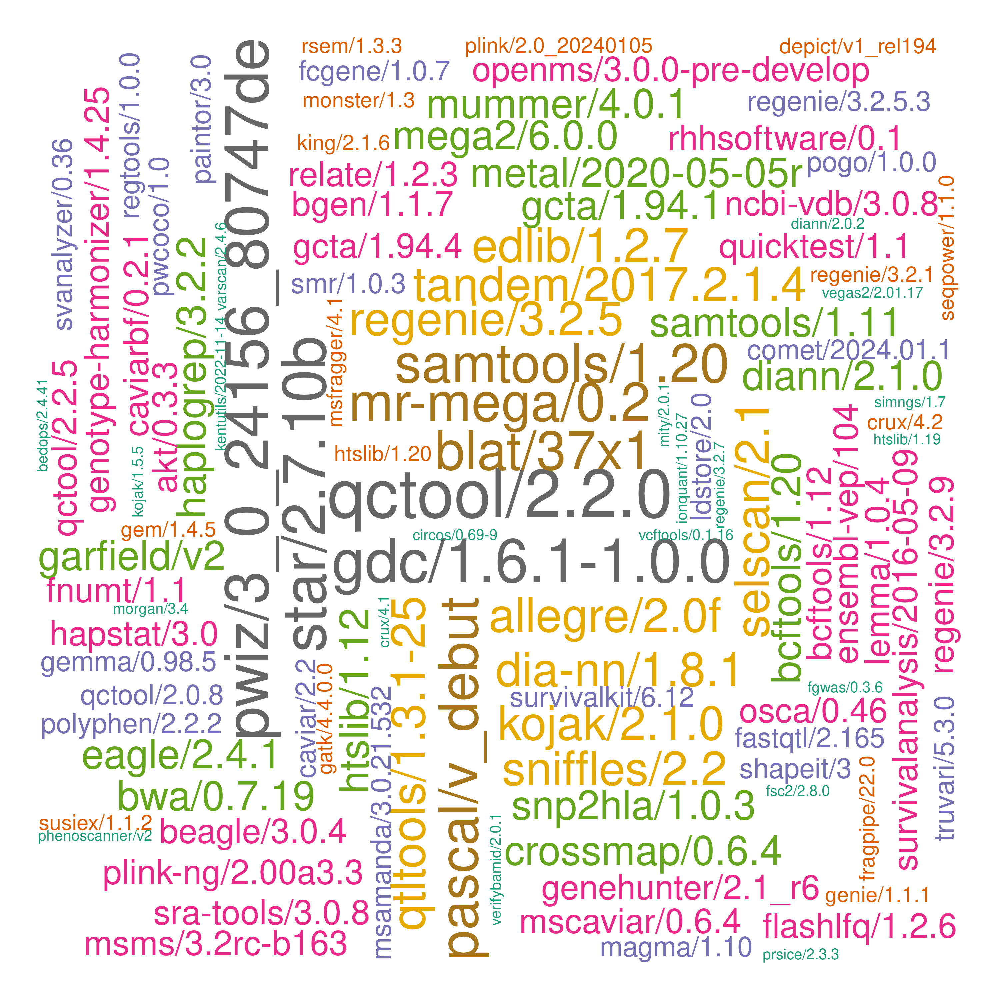

# ceuadmin

The CEU software repository is here, **/usr/local/Cluster-Apps/ceuadmin/**.


noting that the importance of software is purely random according to $$Poisson(N,\lambda)$$ where $$N=215$$, $$\lambda=3$$.

## Entries

The current list is as follows,

```
  [1] "ABCtoolbox"            "akt"                   "allegro"               "alpine"
  [5] "Anaconda3"             "annovar"               "aria2"                 "autoconf"
  [9] "automake"              "axel"                  "bazel"                 "bcftools"
 [13] "Beagle"                "bedops"                "bedtools2"             "bgen"
 [17] "biobank"               "blat"                  "boltlmm"               "brotli"
 [21] "busybox"               "CaVEMaN"               "CAVIAR"                "CAVIARBF"
 [25] "ccal"                  "circos"                "citeproc"              "cmake"
 [29] "cppunit"               "crossmap"              "Cytoscape"             "deno"
 [33] "DEPICT"                "DjVuLibre"             "docbook2X"             "DosageConverter"
 [37] "Eagle"                 "enchant"               "ensembl-vep"           "exiv2"
 [41] "exomeplus"             "expat"                 "FastQTL"               "fcGENE"
 [45] "ffmpeg"                "fgwas"                 "finemap"               "fossil"
 [49] "fpc"                   "fraposa_pgsc"          "fribidi"               "GARFIELD"
 [53] "gatk"                  "gcta"                  "gdal"                  "gdc"
 [57] "geany"                 "GEM"                   "GEMMA"                 "Genotype-Harmonizer"
 [61] "gettext"               "gh"                    "ghc"                   "ghostscript"
 [65] "git"                   "git-extras"            "GitKraken"             "glib"
 [69] "glibc"                 "globusconnectpersonal" "glpk"                  "gmp"
 [73] "gnutls"                "go"                    "googletest"            "graphene"
 [77] "GraphicsMagick"        "GreenAlgorithms4HPC"   "gsl"                   "gtk+"
 [81] "gtksourceview"         "gtool"                 "hpg"                   "htslib"
 [85] "hunspell"              "icu"                   "ImageJ"                "impute"
 [89] "JabRef"                "JAGS"                  "jq"                    "KentUtils"
 [93] "KING"                  "lapack"                "ldc2"                  "ldsc"
 [97] "LDstore"               "LEMMA"                 "libcares"              "libgit2"
[101] "libglvnd"              "libiconv"              "libidn2"               "libntlm"
[105] "libpng"                "libseccomp"            "libsodium"             "libssh2"
[109] "libuv"                 "libxml2"               "libxslt"               "locuszoom"
[113] "MAGENTA"               "magma"                 "Mango"                 "Mega2"
[117] "metal"                 "MONSTER"               "MORGAN"                "MR-MEGA"
[121] "MsCAVIAR"              "nano"                  "ncbi-vdb"              "ncurses"
[125] "netbeans"              "nettle"                "nextflow"              "NLopt"
[129] "node"                  "nspr"                  "oniguruma"             "openjdk"
[133] "OpenMS"                "openssh"               "openssl"               "osca"
[137] "PAINTOR"               "pandoc"                "pandoc-citeproc"       "pango"
[141] "parallel"              "Pascal"                "pcre2"                 "pdf2djvu"
[145] "pdfjam"                "pgsc_calc"             "phenoscanner"          "PhySO"
[149] "picard"                "plink"                 "plink-bgi"             "plinkseq"
[153] "PoGo"                  "polyphen"              "poppler"               "proj"
[157] "PRSice"                "pspp"                  "pulsar"                "PWCoCo"
[161] "qctool"                "qpdf"                  "qt"                    "qtcreator"
[165] "QTLtools"              "quarto"                "quicktest"             "R"
[169] "raremetal"             "rclone"                "readline"              "regenie"
[173] "regtools"              "RHHsoftware"           "rst2pdf"               "rstudio"
[177] "ruby"                  "rust"                  "samtools"              "Scala"
[181] "shapeit"               "singularity"           "SMR"                   "snakemake"
[185] "SNP2HLA"               "snptest"               "spread-sheet-widget"   "sqlite"
[189] "sra-tools"             "ssw"                   "STAR"                  "stata"
[193] "SurvivalAnalysis"      "SurvivalKit"           "Swift"                 "tabix"
[197] "tatami"                "thunderbird"           "tidy"                  "trinculo"
[201] "trousers"              "Typora"                "unbound"               "vala"
[205] "VarScan"               "vcftools"              "VEGAS2"                "verifyBamID"
[209] "VSCode"                "VSCodium"              "vte"                   "xpdf"
[213] "yaml-cpp"              "Zotero"                "zstd"
```

These are wrapped up as :star::star::star: **[modules](https://modules.readthedocs.io/en/latest/index.html)** :star::star::star:.

The original list prior to mid-November 2022 is given below[^original].

## Usage

We illustrate with `pspp`. A brief description of a module is available with

```bash
module help ceuadmin/pspp
```

and the module is loaded and graphical user interface (GUI)[^gui] started with

```bash
module load ceuadmin/pspp
psppire
```

for version 2.0.0-pre1. Once the job is done, one can restore the previous environment with

```bash
module unload ceuadmin/pspp
```

Note that `module add/rm` is equivalent to `module load/unload`.

Some modules are based on compiled Java (.jar) which can be called directly but it is handy to use preset environment variables, e.g.,

```bash
module load ceuadmin/picard
java -jar ${PICARD_HOME}/picard.jar --help

```

A full list of module subcommands is available with `module help` as detailed here for
[3.2.9](https://linux.die.net/man/4/modulefile) -- CSD3 uses version 3.2.10 dated 2012-12-21. In particular, `module whatis ceuadmin/ensembl-vep` indicates usage regarding build37/build38 setup for the `loftee` plugin used in loss of function (LoF)
annotation.

Most software are available for all CSD3 users, only limited by software with excessive size / reference data -- which ideally will be
available from `/rds/project/jmmh2/software` but now `/rds/project/jmmh2/rds-jmmh2-public_databases/software` as a trade-off. These can
largely be seen as sources which are used to build the reoository given above.

CEU users will be able to use `ANNOVAR`, `ensembl-vep`, `OpenMS`, `polyphen`, `KentUtils`/`MAGMA`/`Pascal`/`VEGASV2`/`fgwas`/`locuszoom`
linking internal projects/personal space (additional requests need to be made). A large collection of R packages (1,414 as of 14/3/2024)
is linked with the latest R distribution, 4.3.3; there are also nine packages under 4.3.3-gcc11.

For CEU users, it is easy to point to them, e.g.,

```bash
export HPC_WORK=/rds/user/$USER/hpc-work/
export RDS=/rds/project/jmmh2/rds-jmmh2-public_databases/software
export R_LIBS=${RDS}/R:${RDS}/R-4.3.3/library
```

or possible to have your own installations based on these, e.g., through creation of a modified `Makefile` with altered prefix followed
by `make install -f <modified Makefile>`.

The following script tests for loading of `dplyr`:

```bash
export RDS=/rds/project/jmmh2/rds-jmmh2-public_databases/software
export PATH=${PATH}:${RDS}/R-4.3.3/bin
export R_LIBS=${RDS}/R-4.3.3/library:${RDS}/R
Rscript -e 'suppressMessages(library(dplyr));cat("OK!\n")'
```

It appears clumsy to do these every time, so an attempt is made to have them in a module, namely

```bash
module load ceuadmin/R/latest
which R
echo $R_LIBS
Rscript -e 'suppressMessages(library(dplyr));cat("OK!\n")'
```

For non-CEU users, please drop an email to <jhz22@medschl.cam.ac.uk> for access.

## Module creation

The following example shows how to set up a module,

```bash
#!/bin/bash

mkdir tmp-xz
cd tmp-xz
wget http://tukaani.org/xz/xz-5.2.2.tar.gz
tar zxvf xz-5.2.2.tar.gz
cd xz-5.2.2
mkdir -p /usr/local/Cluster-Apps/xz/5.2.2
export PREFIX=/usr/local/Cluster-Apps/xz/5.2.2
./configure --prefix=$PREFIX
make
make check
sg swinst 'make install'

cat << 'EOL' > /usr/local/Cluster-Config/modulefiles/xz/5.2.2
#%Module -*- tcl -*-
##
## modulefile
##
proc ModulesHelp { } {

  puts stderr "\tXZ Utils is free general-purpose data compression software with a high compression ratio.\n"
  puts stderr "\tInstalled under: /usr/local/Cluster-Apps/xz/5.2.2
     Hompage:http://tukaani.org/xz/"

}

module-whatis "xz free general-purpose data compression"

conflict xz
set               root                  /usr/local/Cluster-Apps/xz/5.2.2
prepend-path      PATH                  $root/bin
prepend-path      MANPATH               $root/man
prepend-path      LD_LIBRARY_PATH       $root/lib
prepend-path      LIBRARY_PATH          $root/lib
prepend-path      FPATH                 $root/include
prepend-path      CPATH                 $root/include
prepend-path      INCLUDE               $root/include
setenv            XZ_HOME               $root
EOL
```

The module is made visible through environment variable MODULEPATH. Note that there will be permission issue for a user, however, to make changes to `/usr/local/Cluster-Apps`.

The module files are defined at **/usr/local/Cluster-Config/modulefiles/ceuadmin**. Most software use gcc/6; when required it can be enabled with `module load gcc/6`; however packages could also require `libgfortran.so.5` as in `gcc/9` -- as a compromise one can amend `.bashrc` to include lines such as `export LD_LIBRARY_PATH=/usr/local/software/master/gcc/9/lib64:$LD_LIBRARY_PATH`.

## Footnotes

Further information is avaiiable from **/usr/local/Cluster-Apps/ceuadmin/doc/ceuadmin.md, ceuadmin.html**.

---

[^original]:
    The original list was a mixture of modules and directories as follows,

    ```
    bgenix/               impute_v2.3.2_x86_64_static/  plink/                        R/                 Raremetal_linux_executables/        snptest_new/
    biobank/              interval/                     plink_1.90_beta/              raremetal_4.13/    Raremetal_linux_executables.tgz     source/
    boltlmm/              JAGS/                         plink_bgi_Dev/                raremetal_4.13.3/  raremetal.log                       stata/
    boltlmm_2.2/          LDstore/                      plink-bgi_linux_x86_64_may/   raremetal_4.13.4/  regenie/                            tabix/
    crossmap/             locuszoom/                    plink_linux_x86_64_beta2a/    raremetal_4.13.5/  samtools-1.10.tar.bz2               temp/
    exomeplus/            magma/                        plink_linux_x86_64_beta3.32/  raremetal_4.13.7/  samtools_1.2/                       vcftools/
    gcta/                 MAGMA_Celltyping/             plinkseq-0.08-x86_64/         raremetal_4.13.8/  shapeit.v2.r790.RHELS_5.4.dynamic/  vcftools_ps629/
    gtool_v0.7.5_x86_64/  metabolomics/                 plinkseq-0.10/                raremetal_4.14.0/  snptest/
    hpg/                  metal/                        pspp/                         raremetal_4.14.1/  snptest_2.5.2/
    htslib/               metal_updated/                qctool_v1.4-linux-x86_64/     raremetal_BPGen/   snptest_2.5.4_beta3/
    ```

    A grep of recent add-ons in the Genetics category is as follows,

    | Date       | Add.ons                     | Category            |
    | :--------- | :-------------------------- | :------------------ |
    | 2022-10-22 | snptest/2.5.6               | Genetics            |
    | ""         | qctool/2.0.8                | Genetics            |
    | ""         | gcta/1.94.1                 | Genetics            |
    | ""         | KING/2.1.6                  | Genetics            |
    | ""         | LDstore/2.0                 | Genetics            |
    | ""         | shapeit/3                   | Genetics            |
    | ""         | vcftools/0.1.16             | Genetics            |
    | ""         | finemap/1.4                 | Genetics            |
    | 2022-10-23 | quicktest/1.1               | Genetics            |
    | ""         | samtools/1.11               | Genetics            |
    | ""         | bcftools/1.12               | Genetics            |
    | ""         | MORGAN/3.4                  | Genetics            |
    | ""         | METAL/2020-05-05r           | Genetics[^metal]    |
    | ""         | regenie/3.2.1               | Genetics            |
    | ""         | GEMMA/0.98.5                | Genetics[^gemma]    |
    | ""         | htslib/1.12                 | Genetics            |
    | ""         | fcGENE/1.0.7                | Genetics[^fcgene]   |
    | ""         | SMR/1.0.3                   | Genetics            |
    | ""         | FastQTL/2.165               | Genetics            |
    | 2022-10-26 | circos/0.69-9               | Genetics            |
    | ""         | bgen/1.1.7                  | Genetics            |
    | ""         | DosageConverter/1.0.0       | Genetics            |
    | ""         | QTLtools/1.3.1-25           | Genetics[^qtltools] |
    | ""         | blat/37x1                   | Genetics            |
    | ""         | bedtools2/2.29.2            | Genetics            |
    | ""         | bedops/2.4.41               | Genetics            |
    | 2022-11-03 | Beagle/3.0.4                | Genetics            |
    | 2022-11-08 | CrossMap/0.6.4              | Genetics            |
    | ""         | SurvivalKit/6.12            | Genetics            |
    | ""         | PRSice/2.3.3                | Genetics            |
    | 2022-11-09 | qctool/2.2.0                | Genetics            |
    | 2022-11-10 | CaVEMaN/1.01-c1815a0        | Genetics            |
    | ""         | akt/0.3.3                   | Genetics            |
    | ""         | MsCAVIAR/0.6.4              | Genetics            |
    | ""         | CAVIAR/2.2                  | Genetics            |
    | ""         | MONSTER/1.3                 | Genetics            |
    | ""         | osca/0.46                   | Genetics            |
    | ""         | LEMMA/1.0.4                 | Genetics[^lemma]    |
    | ""         | CAVIARBF/0.2.1              | Genetics            |
    | 2022-11-11 | PAINTOR/3.0                 | Genetics            |
    | 2022-11-14 | MR-MEGA/0.2                 | Genetics            |
    | 2022-11-16 | SNP2HLA/1.0.3               | Genetics            |
    | ""         | STAR/2.7.10b                | Genetics            |
    | ""         | Mega2/6.0.0                 | Genetics            |
    | 2022-11-19 | ensembl-vep/104             | Genetics\*          |
    | ""         | OpenMS/3.0.0                | Genetics\*[^openms] |
    | ""         | polyphen/2.2.2              | Genetics\*          |
    | ""         | ANNOVAR/24Oct2019           | Genetics\*          |
    | ""         | MAGENTA/vs2_July2011        | Genetics\*          |
    | ""         | GARFIELD/v2                 | Genetics\*          |
    | ""         | KentUtils/2022-11-14        | Genetics\*          |
    | 2022-11-20 | Genotype-Harmonizer/1.4.25  | Genetics            |
    | 2022-11-21 | locuszoom/1.4               | Genetics\*[^lz]     |
    | ""         | DEPICT/v1_rel194            | Genetics\*          |
    | ""         | MAGMA/1.10                  | Genetics\*          |
    | ""         | Pascal/v_debut              | Genetics\*          |
    | ""         | VEGAS2/2.01.17              | Genetics\*          |
    | ""         | fgwas/0.3.6                 | Genetics\*          |
    | 2022-12-04 | phenoscanner/v2             | Genetics\*          |
    | 2022-12-07 | SurvivalAnalysis/2016-05-09 | Genetics            |
    | 2023-01-03 | Eagle/2.4.1                 | Genetics            |
    | 2023-01-05 | GEM/1.4.5                   | Genetics            |
    | 2023-02-01 | GENEHUNTER/2.1_r6           | Genetics            |
    | 2023-03-14 | regenie/3.2.5               | Genetics            |
    | 2023-03-24 | PoGo/1.0.0                  | Genetics            |
    | 2023-03-31 | PWCoCo/2023-03-31           | Genetics[^pwcoco]   |
    | 2023-04-02 | regenie/3.2.5.3             | Genetics            |
    | 2023-04-04 | PWCoCo/1.0                  | Genetics            |
    | 2023-06-02 | regenie/3.2.7               | Genetics[^regenie]  |
    | 2023-06-06 | allegro/2.0f                | Genetics            |
    | 2023-06-19 | plink-ng/2.00a3.3           | Genetics            |
    | 2023-06-26 | RHHsoftware/0.1             | Genetics            |
    | 2023-07-28 | PWCoCo/1.1                  | Genetics            |
    | 2023-08-02 | regenie/3.2.9               | Genetics            |
    | 2023-08-06 | finemap/1.4.2               | Genetics            |
    | 2023-09-27 | ncbi-vdb/3.0.8              | Genetics            |
    | ""         | sra-tools/3.0.8             | Genetics            |
    | ""         | gatk/4.4.0.0                | Genetics            |
    | 2023-11-24 | ldsc/1.0.1                  | Genetics            |
    | 2023-11-30 | gdc/1.6.1-1.0.0             | Genetics[^gdc]      |
    | 2023-12-20 | verifyBamID/1.1.3           | Genetics            |
    | 2023-12-21 | verifyBamID/2.0.1           | Genetics            |
    | 2023-12-27 | regtools/1.0.0              | Genetics[^regtools] |
    | ""         | VarScan/2.4.6               | Genetics[^varscan]  |
    | 2024-01-08 | picard/3.1.1                | Genetics            |
    | ""         | plink/2.0_20240105          | Genetics            |
    | 2024-01-19 | htslib/1.19                 | Genetics            |
    | 2024-01-24 | fraposa_pgsc/0.1.0          | Genetics[^fraposa]  |
    | ""         | pgsc_calc/2.0.0-alpha.4     | Genetics[^pgsc_calc]|

    \* CEU or approved users only.

    More detailed diagrams on recently added genetics (89) and generic (137) software are as follows,

     

[^gui]: **GUI**

    As GUI-based programs claim more computing resources, it is recommended that they are only used occasionally, e.g., calling back GitHub sessions.

[^metal]: **metal**

    Notes on METAL 2020-05-05r

    This version has options EFFECT_PRINT_PRECISION and STDERR_PRINT_PRECISION (both with default 4) to enable many decimal places.

    The letter `r` as in `2020-05-05r` indicates a replacement of functions in `libsrc/MathStats.cpp` to ensure generality -- [details](files/complaint.pdf) have also been posted to the GitHub page, [https://github.com/statgen/METAL/issues/24](https://github.com/statgen/METAL/issues/24).

    ```
    FATAL ERROR -
    a too large, ITMAX too small in gamma countinued fraction (gcf)

    so the -1.info file could not be generated.
    ```

[^gemma]: **gemma**

    Note on compiling from source

    A considerably smaller (1,097,256 vs 22,721,624) executable, /usr/local/Cluster-Apps/ceuadmin/GEMMA/0.98.5/bin, is generated under CSD3 but the original distribution is used by default.

    ```bash
    module load openblas/0.2.15
    make
    ```

[^fcgene]: **fcgene**

    Alternative site

    See [https://github.com/dr-roshyara/fcgene](https://github.com/dr-roshyara/fcgene)

[^qtltools]: **qtltools**

    The long version number is 1.3.1-25-g6e49f85f20.

[^lemma]: **lemma**

    The documentation indicates a requirement of gcc/9.4, boost/1.78, OpenMP/3.1 and/or Intel MKL Library 2019 Update 1 but it is possible to proceed with gcc/11, cmake-3.19.7-gcc-5.4-5gbsejo, boost-1.66.0-gcc-5.4.0-slpq3un, ceuadmin/bgen/1.1.7.

[^openms]: **openms**

    When the OpenMS module is loaded, pyopenms and alphapept also become available.

[^lz]: **locuszoom**

    The version adds chromosome X data and will have options using INTERVAL data.

[^pwcoco]: **pwcoco**

    It compiles under gcc/9. Upon release of 1.1, this snapshot is removed.

[^regenie]: **regenie**

    Building regenie 3.2.7

    ```bash
    cd ~/rds/public_databases/software/
    wget -qO- https://github.com/rgcgithub/regenie/archive/refs/tags/v3.2.7.tar.gz | \
    tar xvfz -
    cd regenie-3.2.7/
    export BGEN_PATH=~/rds/public_databases/software/bgen
    module load zlib/1.2.11
    export ZLIB_LIBRARY=/usr/local/Cluster-Apps/zlib/1.2.11
    module load gcc/6
    module load cmake-3.19.7-gcc-5.4-5gbsejo
    module load intel/mkl/mic/2018.4
    mkdir build
    cd build
    cmake ..
    make
    ```

[^gdc]: **gdc**

    It also includes gdc_dtt-ui 1.0.0

[^regtools]: **regtools**

    gcc/6 is required for C++11.

[^varscan]: **varscan**

    Simply call `java -jar $VARSCAN_HOME/VarScan.v2.4.6.jar` after `module load ceuadmin/VarScan/2.4.6`.

[^fraposa]: **fraposa**

    Several packages, including poetry, poetry-plugin-export and fraposa_pgsc, will be installed as follows,

    ```bash
    module load ceuadmin/Anaconda3/2023.09-0
    pip install poetry
    pip3 install poetry-plugin-export
    pip install --use-feature=fast-deps .
    scripts/run_example.sh
    ```

    This is necessay since by default `peotry install` will use user's home directory. As indicated from `poetry install --help`:

    The install command reads the poetry.lock file from
    the current directory, processes it, and downloads and installs all the
    libraries and dependencies outlined in that file. If the file does not
    exist it will look for pyproject.toml and do the same.

[^pgsc_calc]: **pgsc_calc**

    Application, <https://pgsc-calc.readthedocs.io/en/latest/index.html>

    ```bash
    nextflow run pgscatalog/pgsc_calc -profile test,singularity
    ```

    It appears quarto is called so presumably under icelake.

