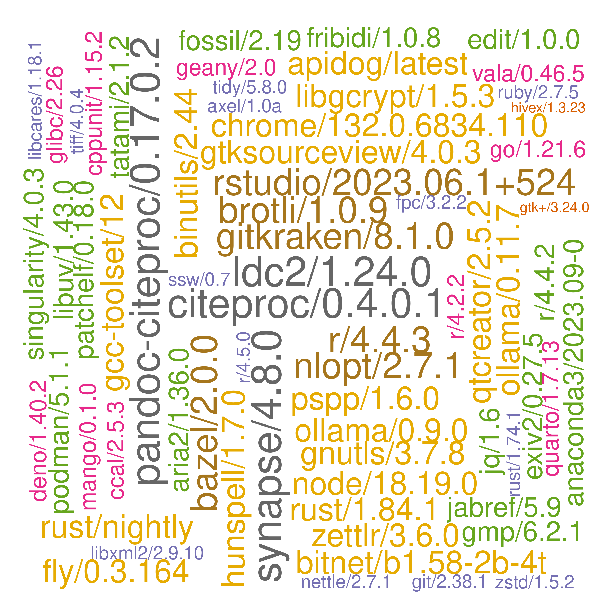
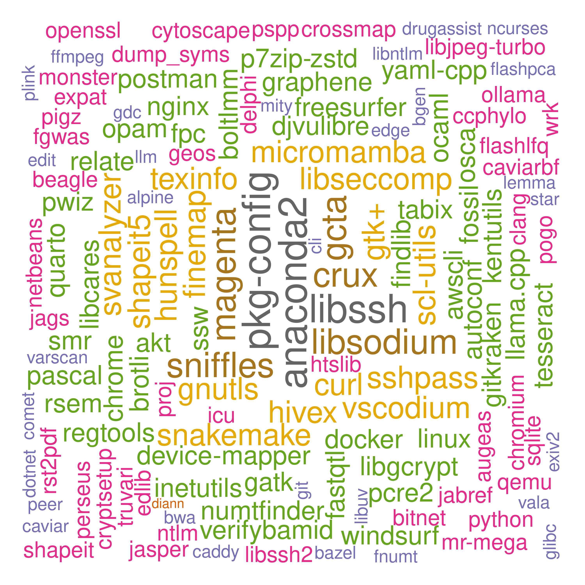

# ceuadmin

The CEU software repository is here, **/usr/local/Cluster-Apps/ceuadmin/**.

More detailed diagrams on recently added genetics/proteomics and generic software are as follows,

 

noting that the importance of software is purely random according to $$Poisson(N,\lambda)$$ where $$N$$ is the number of entries, $$\lambda=3$$.

## Entries

The current list is as follows,

```
  [1] "ABCtoolbox"            "akt"                   "allegro"               "alpine"
  [5] "Anaconda3"             "annovar"               "aria2"                 "augeas"
  [9] "autoconf"              "automake"              "axel"                  "bazel"
 [13] "bcftools"              "Beagle"                "bedops"                "bedtools2"
 [17] "bgen"                  "biobank"               "blat"                  "boltlmm"
 [21] "boost"                 "brotli"                "busybox"               "CaVEMaN"
 [25] "CAVIAR"                "CAVIARBF"              "ccal"                  "circos"
 [29] "citeproc"              "cmake"                 "cppunit"               "crossmap"
 [33] "crux"                  "cryptsetup"            "Cytoscape"             "deno"
 [37] "DEPICT"                "device-mapper"         "diann"                 "DjVuLibre"
 [41] "docbook2X"             "docker"                "DosageConverter"       "dotnet"
 [45] "Eagle"                 "enchant"               "ensembl-vep"           "exiv2"
 [49] "exomeplus"             "expat"                 "FastQTL"               "fcGENE"
 [53] "ffmpeg"                "fgwas"                 "findlib"               "finemap"
 [57] "FlashLFQ"              "fossil"                "fpc"                   "fraposa_pgsc"
 [61] "freesurfer"            "fribidi"               "GARFIELD"              "gatk"
 [65] "gcta"                  "gdal"                  "gdc"                   "geany"
 [69] "GEM"                   "GEMMA"                 "Genotype-Harmonizer"   "gettext"
 [73] "gh"                    "ghc"                   "ghostscript"           "git"
 [77] "git-extras"            "GitKraken"             "glib"                  "glibc"
 [81] "globusconnectpersonal" "glpk"                  "gmp"                   "gnutls"
 [85] "go"                    "googletest"            "graphene"              "GraphicsMagick"
 [89] "GreenAlgorithms4HPC"   "gsl"                   "gtk+"                  "gtksourceview"
 [93] "gtool"                 "hivex"                 "hpg"                   "htslib"
 [97] "hunspell"              "icu"                   "ImageJ"                "ImageMagick"
[101] "impute"                "JabRef"                "JAGS"                  "jq"
[105] "json-c"                "KentUtils"             "KING"                  "krb5"
[109] "lapack"                "ldc2"                  "ldsc"                  "LDstore"
[113] "LEMMA"                 "libcares"              "libgit2"               "libglvnd"
[117] "libiconv"              "libidn2"               "libntlm"               "libpng"
[121] "libseccomp"            "libsodium"             "libssh"                "libssh2"
[125] "libuv"                 "libxml2"               "libxslt"               "linux"
[129] "locuszoom"             "LVM2"                  "MAGENTA"               "magma"
[133] "Mango"                 "Mega2"                 "metal"                 "MetaMorpheus"
[137] "Miniconda3"            "MONSTER"               "MORGAN"                "MR-MEGA"
[141] "msamanda"              "MsCAVIAR"              "msms"                  "nano"
[145] "ncbi-vdb"              "ncurses"               "netbeans"              "nettle"
[149] "nextflow"              "nlopt"                 "NLopt"                 "node"
[153] "nspr"                  "ntlm"                  "ocaml"                 "oniguruma"
[157] "opam"                  "openjdk"               "OpenMS"                "openssh"
[161] "openssl"               "osca"                  "p7zip-zstd"            "PAINTOR"
[165] "pandoc"                "pandoc-citeproc"       "pango"                 "parallel"
[169] "Pascal"                "patchelf"              "pcre2"                 "pdf2djvu"
[173] "pdfjam"                "peer"                  "pgsc_calc"             "phenoscanner"
[177] "PhySO"                 "picard"                "pigz"                  "plink"
[181] "plink-bgi"             "plinkseq"              "podman"                "PoGo"
[185] "polyphen"              "poppler"               "popt"                  "proj"
[189] "PRSice"                "pspp"                  "pulsar"                "PWCoCo"
[193] "pwiz"                  "qctool"                "qemu"                  "qpdf"
[197] "qt"                    "qtcreator"             "QTLtools"              "quarto"
[201] "quicktest"             "R"                     "raremetal"             "rclone"
[205] "readline"              "regenie"               "regtools"              "RHHsoftware"
[209] "rst2pdf"               "rstudio"               "rtmpdump"              "ruby"
[213] "rust"                  "samtools"              "Scala"                 "seqkit"
[217] "shapeit"               "singularity"           "SMR"                   "snakemake"
[221] "SNP2HLA"               "snptest"               "spread-sheet-widget"   "spyder"
[225] "sqlite"                "sra-tools"             "sshpass"               "ssw"
[229] "STAR"                  "stata"                 "SurvivalAnalysis"      "SurvivalKit"
[233] "Swift"                 "tabix"                 "tandem"                "tatami"
[237] "thunderbird"           "tidy"                  "trinculo"              "trousers"
[241] "Typora"                "unbound"               "vala"                  "VarScan"
[245] "vcftools"              "VEGAS2"                "verifyBamID"           "VSCode"
[249] "VSCodium"              "vte"                   "wine"                  "xpdf"
[253] "yaml-cpp"              "Zotero"                "zstd"
```

These are wrapped up as :star::star::star: **[modules](https://modules.readthedocs.io/en/latest/index.html)** :star::star::star:.

The original list prior to mid-November 2022 is given below[^original].

## Usage

We illustrate with `pspp`. A brief description of a module is available with

```bash
module help ceuadmin/pspp
```

and the module is loaded and graphical user interface (GUI)[^gui] started with

```bash
module load ceuadmin/pspp
psppire
```

for version 2.0.0-pre1. Once the job is done, one can restore the previous environment with

```bash
module unload ceuadmin/pspp
```

Note that `module add/rm` is equivalent to `module load/unload`.

Some modules are based on compiled Java (.jar) which can be called directly but it is handy to use preset environment variables, e.g.,

```bash
module load ceuadmin/picard
java -jar ${PICARD_HOME}/picard.jar --help

```

A full list of module subcommands is available with `module help` as detailed here for
[3.2.9](https://linux.die.net/man/4/modulefile) -- cclake uses version 3.2.10 (2012-12-21) while icelake uses 4.5.2 (2020-07-30). In particular, `module whatis ceuadmin/ensembl-vep` indicates usage regarding build37/build38 setup for the `loftee` plugin used in loss of function (LoF)
annotation.

Most software are available for all CSD3 users, only limited by software with excessive size / reference data -- which ideally will be
available from `/rds/project/jmmh2/software` but now `/rds/project/jmmh2/rds-jmmh2-public_databases/software` as a trade-off. These can
largely be seen as sources which are used to build the reoository given above.

CEU users will be able to use `ANNOVAR`, `ensembl-vep`, `OpenMS`, `phenoscanner`, `polyphen`, `KentUtils`/`MAGMA`/`Pascal`/`VEGASV2`/`fgwas`/`locuszoom`
linking internal projects/personal space (additional requests need to be made). A large collection of R packages (1,542 as of 2/8/2024)
is linked with the latest R distribution, 4.4.1; there are also 19 packages under R-gcc11.

For CEU users, it is easy to point to them, e.g.,

```bash
export HPC_WORK=/rds/user/$USER/hpc-work/
export RDS=/rds/project/jmmh2/rds-jmmh2-public_databases/software
export R_LIBS=${RDS}/R:${RDS}/R-4.4.1/library
```

or possible to have your own installations based on these, e.g., through creation of a modified `Makefile` with altered prefix followed
by `make install -f <modified Makefile>`.

The following script tests for loading of `dplyr`:

```bash
export RDS=/rds/project/jmmh2/rds-jmmh2-public_databases/software
export PATH=${PATH}:${RDS}/R-4.4.1/bin
export R_LIBS=${RDS}/R-4.4.1/library:${RDS}/R
Rscript -e 'suppressMessages(library(dplyr));cat("OK!\n")'
```

It appears clumsy to do these every time, so an attempt is made to have them in a module, namely

```bash
module load ceuadmin/R/latest
which R
echo $R_LIBS
Rscript -e 'suppressMessages(library(dplyr));cat("OK!\n")'
```

For non-CEU users, please drop an email to <jhz22@medschl.cam.ac.uk> for access.

## Module creation

The following example shows how to set up a module,

```bash
#!/bin/bash

mkdir tmp-xz
cd tmp-xz
wget http://tukaani.org/xz/xz-5.2.2.tar.gz
tar zxvf xz-5.2.2.tar.gz
cd xz-5.2.2
mkdir -p /usr/local/Cluster-Apps/xz/5.2.2
export PREFIX=/usr/local/Cluster-Apps/xz/5.2.2
./configure --prefix=$PREFIX
make
make check
sg swinst 'make install'

cat << 'EOL' > /usr/local/Cluster-Config/modulefiles/xz/5.2.2
#%Module -*- tcl -*-
##
## modulefile
##
proc ModulesHelp { } {

  puts stderr "\tXZ Utils is free general-purpose data compression software with a high compression ratio.\n"
  puts stderr "\tInstalled under: /usr/local/Cluster-Apps/xz/5.2.2
     Hompage:http://tukaani.org/xz/"

}

module-whatis "xz free general-purpose data compression"

conflict xz
set               root                  /usr/local/Cluster-Apps/xz/5.2.2
prepend-path      PATH                  $root/bin
prepend-path      MANPATH               $root/man
prepend-path      LD_LIBRARY_PATH       $root/lib
prepend-path      LIBRARY_PATH          $root/lib
prepend-path      FPATH                 $root/include
prepend-path      CPATH                 $root/include
prepend-path      INCLUDE               $root/include
setenv            XZ_HOME               $root
EOL
```

The module is made visible through environment variable MODULEPATH. Note that there will be permission issue for a user, however, to make changes to `/usr/local/Cluster-Apps`.

The module files are defined at **/usr/local/Cluster-Config/modulefiles/ceuadmin**. Most software stay with gcc/6 due to many dependencies of built modules; when required it can be enabled with `module load gcc/6`; however packages could also require `libgfortran.so.5` as in `gcc/9` -- as a compromise one can amend `.bashrc` to include lines such as `export LD_LIBRARY_PATH=/usr/local/software/master/gcc/9/lib64:$LD_LIBRARY_PATH`.

## Footnotes

Further information is avaiiable from **/usr/local/Cluster-Apps/ceuadmin/doc/ceuadmin.md, ceuadmin.html**.

---

[^original]:
    The original list was a mixture of modules and directories as follows,

    ```
    bgenix/               impute_v2.3.2_x86_64_static/  plink/                        R/                 Raremetal_linux_executables/        snptest_new/
    biobank/              interval/                     plink_1.90_beta/              raremetal_4.13/    Raremetal_linux_executables.tgz     source/
    boltlmm/              JAGS/                         plink_bgi_Dev/                raremetal_4.13.3/  raremetal.log                       stata/
    boltlmm_2.2/          LDstore/                      plink-bgi_linux_x86_64_may/   raremetal_4.13.4/  regenie/                            tabix/
    crossmap/             locuszoom/                    plink_linux_x86_64_beta2a/    raremetal_4.13.5/  samtools-1.10.tar.bz2               temp/
    exomeplus/            magma/                        plink_linux_x86_64_beta3.32/  raremetal_4.13.7/  samtools_1.2/                       vcftools/
    gcta/                 MAGMA_Celltyping/             plinkseq-0.08-x86_64/         raremetal_4.13.8/  shapeit.v2.r790.RHELS_5.4.dynamic/  vcftools_ps629/
    gtool_v0.7.5_x86_64/  metabolomics/                 plinkseq-0.10/                raremetal_4.14.0/  snptest/
    hpg/                  metal/                        pspp/                         raremetal_4.14.1/  snptest_2.5.2/
    htslib/               metal_updated/                qctool_v1.4-linux-x86_64/     raremetal_BPGen/   snptest_2.5.4_beta3/
    ```

    A grep of recent add-ons in the Genetics/Proteomics category is as follows,

    | Date       | Add.ons                     | Category            |
    | :--------- | :-------------------------- | :------------------ |
    | 2022-10-22 | snptest/2.5.6               | Genetics            |
    | ""         | qctool/2.0.8                | Genetics            |
    | ""         | gcta/1.94.1                 | Genetics            |
    | ""         | KING/2.1.6                  | Genetics            |
    | ""         | LDstore/2.0                 | Genetics            |
    | ""         | shapeit/3                   | Genetics            |
    | ""         | vcftools/0.1.16             | Genetics            |
    | ""         | finemap/1.4                 | Genetics            |
    | 2022-10-23 | quicktest/1.1               | Genetics            |
    | ""         | samtools/1.11               | Genetics            |
    | ""         | bcftools/1.12               | Genetics            |
    | ""         | MORGAN/3.4                  | Genetics            |
    | ""         | METAL/2020-05-05r           | Genetics            |
    | ""         | regenie/3.2.1               | Genetics            |
    | ""         | GEMMA/0.98.5                | Genetics            |
    | ""         | htslib/1.12                 | Genetics            |
    | ""         | fcGENE/1.0.7                | Genetics            |
    | ""         | SMR/1.0.3                   | Genetics            |
    | ""         | FastQTL/2.165               | Genetics            |
    | 2022-10-26 | circos/0.69-9               | Genetics            |
    | ""         | bgen/1.1.7                  | Genetics            |
    | ""         | DosageConverter/1.0.0       | Genetics            |
    | ""         | QTLtools/1.3.1-25           | Genetics            |
    | ""         | blat/37x1                   | Genetics            |
    | ""         | bedtools2/2.29.2            | Genetics            |
    | ""         | bedops/2.4.41               | Genetics            |
    | 2022-11-03 | Beagle/3.0.4                | Genetics            |
    | 2022-11-08 | CrossMap/0.6.4              | Genetics            |
    | ""         | SurvivalKit/6.12            | Genetics            |
    | ""         | PRSice/2.3.3                | Genetics            |
    | 2022-11-09 | qctool/2.2.0                | Genetics            |
    | 2022-11-10 | CaVEMaN/1.01-c1815a0        | Genetics            |
    | ""         | akt/0.3.3                   | Genetics            |
    | ""         | MsCAVIAR/0.6.4              | Genetics            |
    | ""         | CAVIAR/2.2                  | Genetics            |
    | ""         | MONSTER/1.3                 | Genetics            |
    | ""         | osca/0.46                   | Genetics            |
    | ""         | LEMMA/1.0.4                 | Genetics            |
    | ""         | CAVIARBF/0.2.1              | Genetics            |
    | 2022-11-11 | PAINTOR/3.0                 | Genetics            |
    | 2022-11-14 | MR-MEGA/0.2                 | Genetics            |
    | 2022-11-16 | SNP2HLA/1.0.3               | Genetics            |
    | ""         | STAR/2.7.10b                | Genetics            |
    | ""         | Mega2/6.0.0                 | Genetics            |
    | 2022-11-19 | ensembl-vep/104             | Genetics\*          |
    | ""         | OpenMS/3.0.0                | Genetics\*          |
    | ""         | polyphen/2.2.2              | Genetics\*          |
    | ""         | ANNOVAR/24Oct2019           | Genetics\*          |
    | ""         | MAGENTA/vs2_July2011        | Genetics\*          |
    | ""         | GARFIELD/v2                 | Genetics\*          |
    | ""         | KentUtils/2022-11-14        | Genetics\*          |
    | 2022-11-20 | Genotype-Harmonizer/1.4.25  | Genetics            |
    | 2022-11-21 | locuszoom/1.4               | Genetics\*          |
    | ""         | DEPICT/v1_rel194            | Genetics\*          |
    | ""         | MAGMA/1.10                  | Genetics\*          |
    | ""         | Pascal/v_debut              | Genetics\*          |
    | ""         | VEGAS2/2.01.17              | Genetics\*          |
    | ""         | fgwas/0.3.6                 | Genetics\*          |
    | 2022-12-04 | phenoscanner/v2             | Genetics\*          |
    | 2022-12-07 | SurvivalAnalysis/2016-05-09 | Genetics            |
    | 2023-01-03 | Eagle/2.4.1                 | Genetics            |
    | 2023-01-05 | GEM/1.4.5                   | Genetics            |
    | 2023-02-01 | GENEHUNTER/2.1_r6           | Genetics            |
    | 2023-03-14 | regenie/3.2.5               | Genetics            |
    | 2023-03-24 | PoGo/1.0.0                  | Genetics            |
    | 2023-03-31 | PWCoCo/2023-03-31           | Genetics            |
    | 2023-04-02 | regenie/3.2.5.3             | Genetics            |
    | 2023-04-04 | PWCoCo/1.0                  | Genetics            |
    | 2023-06-02 | regenie/3.2.7               | Genetics            |
    | 2023-06-06 | allegro/2.0f                | Genetics            |
    | 2023-06-19 | plink-ng/2.00a3.3           | Genetics            |
    | 2023-06-26 | RHHsoftware/0.1             | Genetics            |
    | 2023-07-28 | PWCoCo/1.1                  | Genetics            |
    | 2023-08-02 | regenie/3.2.9               | Genetics            |
    | 2023-08-06 | finemap/1.4.2               | Genetics            |
    | 2023-09-27 | ncbi-vdb/3.0.8              | Genetics            |
    | ""         | sra-tools/3.0.8             | Genetics            |
    | ""         | gatk/4.4.0.0                | Genetics            |
    | 2023-11-24 | ldsc/1.0.1                  | Genetics            |
    | 2023-11-30 | gdc/1.6.1-1.0.0             | Genetics            |
    | 2023-12-20 | verifyBamID/1.1.3           | Genetics            |
    | 2023-12-21 | verifyBamID/2.0.1           | Genetics            |
    | 2023-12-27 | regtools/1.0.0              | Genetics            |
    | ""         | VarScan/2.4.6               | Genetics            |
    | 2024-01-08 | picard/3.1.1                | Genetics            |
    | ""         | plink/2.0_20240105          | Genetics            |
    | 2024-01-19 | htslib/1.19                 | Genetics            |
    | 2024-01-24 | fraposa_pgsc/0.1.0          | Genetics            |
    | ""         | pgsc_calc/2.0.0-alpha.4     | Genetics            |
    | 2024-04-22 | peer/1.3                    | Genetics            |
    | 2024-06-04 | pwiz/3_0_24156_80747de      | Proteomics          |
    | 2024-06-09 | crux/4.2                    | Proteomics          |
    | ""         | DIA-NN/1.8.1                | Proteomics          |
    | 2024-06-11 | crux/4.1                    | Proteomics          |
    | ""         | pwiz/3_0_24163_9bfa69a-wine | Proteomics          |
    | 2024-06-11 | seqkit/2.8.2                | Proteomics          |
    | ""         | FlashLFQ/1.2.6              | Proteomics          |
    | ""         | MetaMorpheus/1.0.5          | Proteomics          |
    | 2024-06-25 | msms/3.2rc-b163             | Genetics            |
    | 2024-07-13 | msamanda/3.0.21.532         | Proteomics          |
    | 2024-07-31 | tandem/2017.2.1.4           | Proteomics          |

    \* CEU or approved users only.

    

[^gui]: **GUI**

    As GUI-based programs claim more computing resources, it is recommended that they are only used occasionally, e.g., calling back GitHub sessions.
